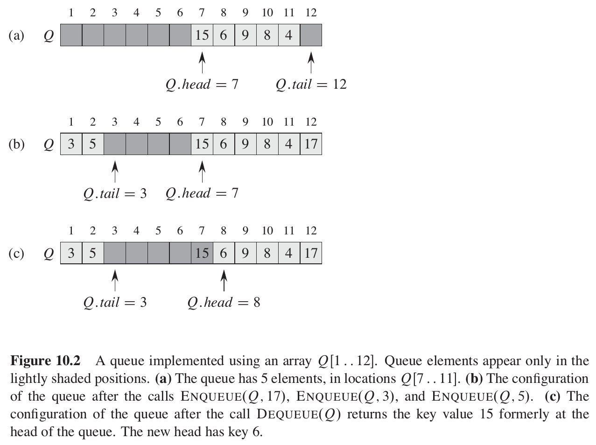

# Data structures

## Operations on dynamic sets

Terms used:
* **Dynamic set** - a set which can grow, shrink, or otherwise change over time.
* **Pointer** - in a typical implementation of a dynamic set each element is represented by an object whose attributes can be examined and manipulated if we have a pointer to it.
* **Satellite data** - data carried around in the object attributes, but unused by set implementation.
* **Key** - some kinds of dynamic sets assume that one of the object's attributes is an identifying key. If the keys are all different, we can think of the dynamic set as being a set of key values.
* **Totally ordered set** - some dynamics sets presuppose that the keys are drawn from a totally ordered set, such as the real numbers.

Operations on dynamic sets can be grouped into two categories:
* **queries** - simply return information about the set;
* **modifying operations** - change the set.

Operations on dynamic sets:
* `SEARCH(S, k)` - a query that, given a set `S` and a key value `k`, returns a pointer `x` to an element in `S` such that `x.key=k`, or `NIL` if no such element belongs to `S`;
* `INSERT(S, x)` - a modifying operation that augments the set `S` with the element pointed by `x`;
* `DELETE(S, x)` - a modifying operation that, given a pointer `x` to an element in the set `S`, removes `x` from `S`;
* `MINIMUM(S)` - a query on totally ordered set `S` that returns pointer to the element of `S` with the smallest key;
* `MAXIMUM(S)` - a query on totally ordered set `S` that returns pointer to the element of `S` with the largest key.
* `SUCCESSOR(S, x)` - a query that, given an element `x` whose key is from a totally ordered set `S`, returns a pointer to the next larger element in `S`, or `NIL` if `x` is the maximum element;
* `PREDECESSOR(S, x)` - a query that, given an element `x` whose key is from a totally ordered set `S`, returns a pointer to the next smaller element in `S`, or `NIL` if `x` is the minimum element.

## Elementary data structures

### Stacks

**Stack** is a dynamic set with `DELETE` operation removing most recently inserted element (**last-in, first-out** policy).
The `INSERT` operation on a stack is often called `PUSH`. The delete operation, which does not take an element argument, is often called `POP`.

A stack of at most `n` elements can be implemented with:
* an array `S[1..n]`;
* attribute `S.top` that indexes the most recently inserted element.

The stack has the following features:
* if `S.top` == 0 the stack is **empty**.
* if we attempt to pop an empty stack, we say the **stack underflows**;
* if we attempt to push so that `S.top` exceeds `n`, the **stack overflows**.

```
STACK_EMPTY(S)
    if S.top == 0
        return true
    else
        return false

PUSH(S, x)
    S.top = S.top + 1
    S[S.top] = x

POP(S)
    if STACK_EMPTY(S)
        error "underflow"
    else S.top = S.top - 1
        return S[S.top + 1]
```

### Queue

**Queue** is a dynamic set with `DELETE` operation removing element that has been in the set for the longest time (**first-in, first-out** policy).
The `INSERT` operation on a queue is often called `ENQUEUE`. The delete operation, which does not take an element argument, is often called `DEQUEUE`.

A queue of at most `n` elements can be implemented with:
* an array `Q[1..n]`;
* attribute `Q.head` that indexes or points to its head;
* attribute `Q.tail` that indexes to **the next location** at which a newly arriving element will be inserted;
* initially we have `Q.head == Q.tail == 1`.

The queue has the following features:
* if `Q.head == Q.tail` the queue is **empty**;
* if we attempt to dequeue an element from an empty queue, the **queue underflows**;
* if `Q.head == Q.tail + 1`, the queue is full, and if we attempt to enqueue an element, then the **queue overflows**.

The fact that `Q.tail` points to **the next location** for a new element is crucial - this way it is possible to differ an empty queue (`Q.head == Q.tail`) from a full one (`Q.head == Q.tail + 1`).
The "circularity" of the queue enables it to have O(1) `ENQUEUE` and `DEQUEUE` operations (no element shifting is needed).



```
ENQUEUE(Q, x)
    // overflow check

    Q[Q.tail] = x
    if Q.tail == Q.length
      Q.tail = 1
    else
      ++Q.tail

DEQUEUE(Q)
    // underflow check

    x = Q[Q.head]
    if Q.head == Q.length
        Q.head = 1
    else
        ++Q.head
    return x
```

**Each of the operations takes O(1) time.**

### Linked list

**Linked list** is a dynamic set having the following features:
* objects are arranged in a linear order;
* the linear order is by a pointer in each object (unlike an array where it is determined by array indices);
* supports all operations listed for dynamic sets (though not necessarily efficiently).

A doubly linked list can be implemented with objects that have:
* attribute `x.next` pointing to next element;
* attribute `x.prev` pointing to previous element;
* attribute `L.head` pointing to the first element;
* attribute `x.key` holding value.

For example, doubly liked list has the following features:
* if `x.prev == NIL` the element `x` is the first element (`head` of the list);
* if `x.next == NIL` the element `x` is the last element (`tail` of the list);
* if `L.head == NILL`, the list is empty.

Linked lists come in different flavours:
* **singly linked** - no `prev` pointer in each element;
* **doubly linked** - there is `prev` pointer in each element;
* **sorted** - the linear order of the list corresponds to the linear order of keys stored in elements of the list (minimal element at head; maximal at tail);
* **unsorted** - elements appear in any order;
* **circular lists** - `prev` pointer of the head of the list points to the tail; `next` pointer of the tail points to the head.

#### Doubly linked list - operations

```
LIST_SEARCH(L, k)
    x = L.head
    while x != NIL and x.key != k
        x = x.next
    return x

LIST_INSERT(L, x)
    x.next = L.head
    if L.head != NIL
        L.head.prev = x
    L.head = x
    x.prev = NIL

LIST_DELETE(L, x)
    if x.prev != NULL
        x.prev.next = x.next
    else
        L.head = x.next

    if x.next != NIL
        x.next.prev = x.prev
```

Running times:
* `LIST_SEARCH` - O(n);
* `LIST_INSERT` - O(1);
* `LIST_DELETE` - O(1).

The running time of `LIST_SEARCH` is based on precondition that pointer to the element is passed.
If we wish to delete an element with given key, O(n) time is required in the worst case because we must first call `LIST_SEARCH`.

#### Circular, doubly linked list with a sentinel

TODO

### Hash Table

**Hash Table** is a dynamic set that supports only dictionary operations:
* `INSERT`;
* `SEARCH`;
* `DELETE`.

**Hash table** average time to search for an element is `O(1)`, however it can be as long as in a linked list - `O(n)`.

#### Direct-address tables

