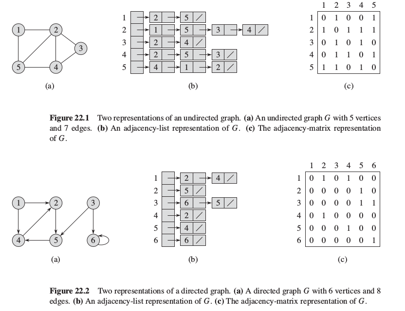

# Graphs

A graph is an ordered pair `G = (V, E)` comprising:
* `V` is a set of vertices (also called nodes, points);
* `E` is a set of edges (for a directed graph also called arrows).

Graph can be:
* undirected or directed;
* unweighted or weighted.

A **sparse graph** is a graph for which `|E|` is much less than `|V|^2`.

The number of edges that are incident to a vertex is called its **degree** (loop is counted twice).

## Representations of graphs

### Adjacency-list representation

For a graph `G = (V, E)`, the adjacency-list representation consists of an array `Adj` of `|V|` lists, one for each vertex in `V`.
For every vertex `u`, list `Adj[u]` contains all the vertives adjacent to `u` in `G`.

Properties of `Adj`:
* it can represent both undirected and directed graphs;
* it provides a compact way to represent sparse graphs;
* if the graph is weighted with function `w(u, v)`, we store the weigh of the edge `(u, v)` with the vertex `v` in `u`'s adjacency list.

In adjacency-list representation the only way to determine whether a given edge `(u, v)` is present in the graph is to search fo `v` in adjacency list `Adj[u]`.

### Adjacency-matrix representation

For a graph `G = (V, E)`, we assume that the vertices are numbered 1, 2, ..., |V| in some arbitrary manner.
The adjacency-matrix representation consists of a `|V| x |V|` matrix `A = (a_ij)` such that
* `a_ij = 1` if edge `(i, j)` is present in the graph;
* `a_ij = 0` otherwise.

Properties of the matrix:
* it requires V^2 memory, independent of the number of edges in the graph;
* for an undirected graph, the matrix is symmetric, so only half of it can be stored, thereby cutting the memory needed almost in half;
* if the graph is weighted, we can simply store the weight `w(u, v)` of the edge `(u, v`) as the entry in row `u` and column `v`; the absence of an edge can be signalled with `nil`, `0`, `inf`, etc.

## Transpose of a graph

The **transpose** of a directed graph `G = (V, E)` is the graph `G^T = (V, E^T)` with all of the edges of `G` reversed.

