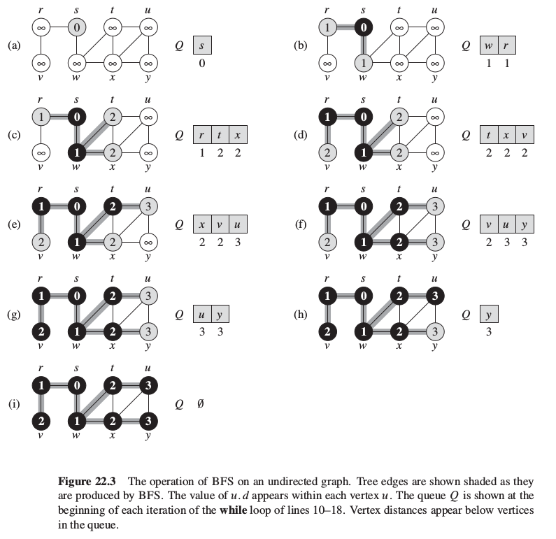

# Breadth-first-search

## Properties

Breadth-first search (BFS) is one of the simplest algorithms for searching a graph and the archetype for other graph algorithms.

The algorithm is so named because it discovers all verices at distance `k` from `s` before discovering any vertices at distance `k + 1`.

Given a graph `G = (V, E)` and a distinguished source vertex `s`, BFS:
* explores edges of `G` to "discover" every vertex that is reachable from `s`;
* computes distance (smallest number of edges) from `s` to each reachable vertex;
* produces "breadth-first tree" with root `s` that contains all reachable vertices.

**BFS runs in time linear to the size of the adjacency-list representation of G.**

## Mechanics

*As in CLRS we distinguish white, gray and black vertices to enhance understandability of the algorithm.*
*However, the result would be the same with only white and black vertcies.*

The mechanics are the following:
1. Firstly all vertices are white and may later become gray and then black.
2. When a vertex is **discovered** the first time it is encountered during the search; then it becomes nonwhite.
3. Gray and black vertices, have been discovered.
4. Black vertex means that all verices adjacent to it have been discovered. In other words, vertex `u` is black so for an edge `(u, v)` vertex `v` is either gray or black.
5. Gray vertes represents the frontier between discovered and undiscovered vertices. In other words, gray vertics may have some adjacent white verices.

## Breadth-first tree

The algorithm produces a breadth-first tree which:
* initially contains only its root, which is the source vertex `s`;
* whenever a vertex `v` is discovered in the process of scanning the adjacency list of an already discovered vertex `u`, the vertex `v` and the edge `(u, v)` are added to the tree;
* this way `u` is the **predecessor** or **parent** of `v` in the breadth-first tree.

## Procedure

The procedure below:
* assumes that the input graph `G = (V, E)` is represented using adjacency lists;
* stores the color of the vertes in attribute `u.color`;
* stores the predecessor of the vertes in attribute `u.pred`;
* stores the distance from the source `s` to vertex `u` computed by the algorithm in attribute `u.dist`;
* uses FIFO queue `Q` to manage the set of gray vertices.

```
BFS(G, s)
  for each vertex u in G.V except s
    u.color = WHITE
    u.dist = INF
    u.pred = NIL

  s.color = GRAY
  s.dist = 0
  s.pred = NIL

  Q = Queue()
  ENQUEUE(Q, s)

  while (NOT_EMPTY(Q))
    u = DEQUEUE(Q)

    for each v in G.Adj[u]
      if (v.color == WHITE)
        v.color = GRAY
        v.dist = u.dist + 1
        v.pred = u
        ENQUEUE(Q, v)

    u.color = BLACK
```




