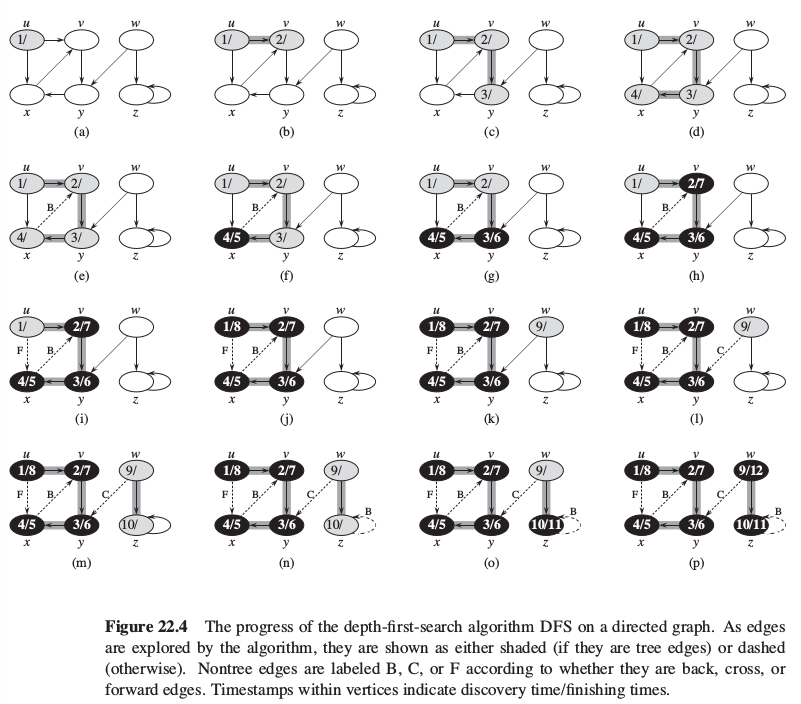
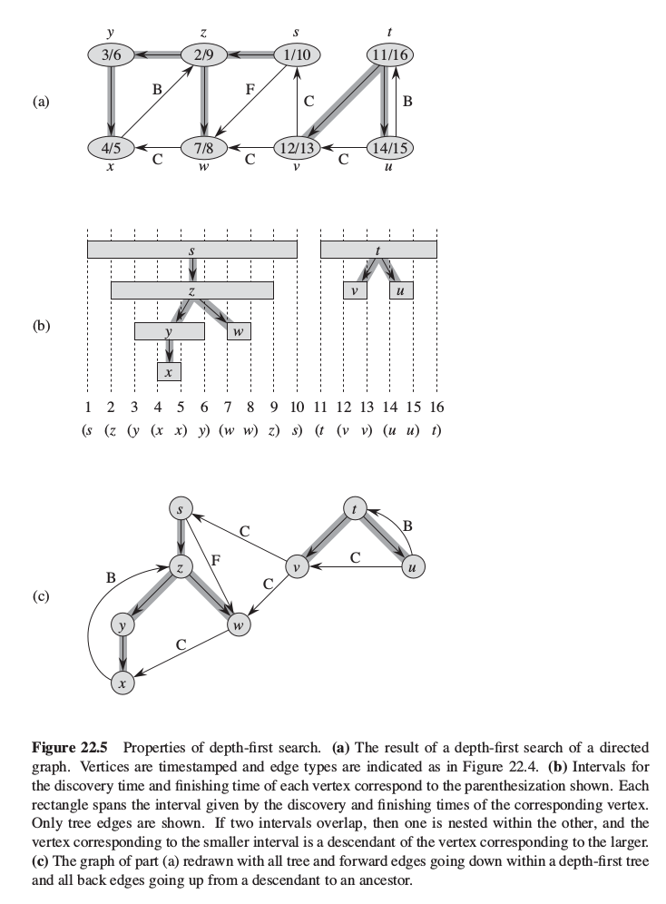

# Depth-first search

## Properties

Depth-first search explores edges out of the most recently discovered vertex `v` that still has unexplored edges leaving it.
Once all of `v`'s edges have been explored, the search "backtracks" to explore edges leaving the vertex from v was discovered.

Given a graph, DFS:
* explores all the edges, going "deeper" whenever it is possible;
* produces depth-first forest comprising several disjoint depth-first trees;
* timestamps each vertex with values characterising the search process.

**DFS runs in time linear to the size of the adjacency-list representation of G.**

## Mechanics

The DFS colors vertices during the search to indicate their state:
* each vertex is initially white;
* when vertex is **discovered** it is grayed;
* when vertex is **finished** - its adjacency list has been examined completely - it is blackened.

This technique guarantees that each vertex ends up in exactly one depth-first tree, so that these trees are disjoint.

## Timestamps

DFS timestamps each vertex with two values:
* first timestamp `v.d` when `v` is first discovered (and grayed);
* second timestamp `v.f` when the search finishes examining `v`'s adjacency list (and `v` is blackened).

The timestamps are integers in range `<1, 2|V|>`. As expected, for each vertex `u` `u.d < u.f`.

## Schema

The schema below:
* assumes presence of a global variable `time` to be used for timestamping;
* accepts both undirected and directed graphs.

```
DFS(G)
  for each vertex u in G.V
    u.color = WHITE
    u.prec = NIL

  time = 0

  for each vertex u in G.V
    if u.color == WHITE
      DFS_VISIT(G, u)

DFS_VISIT(G, u)
  time = time + 1
  u.d = time
  u.color = GRAY

  for each v in G.Adj[u]
    v.prec = u
    DFS_VISIT(G, v)

  u.color = BLACK
  time = time + 1
  u.f = time
```



## DFS and parenthesis structure

In DFS, the discovery and finishing times have **parenthesis structure**:
1. We represent the discovery of vertex `u` with left parenthesis `[u`;
2. The finishing is represented with right parenthesis `u]`.
3. The history of discoveries and finishings makes a well-formed expression in the sense that the parentheses are properly nested.

This way in any DFS of a (directed or undirected) graph `G = (V, E)`, for any two vertices `u` and `v`, exactly one of the following conditions holds: (*Parenthesis theorem*)
* the intervals `[u.d, u.f]` and `[v.d, v.f]` are entirely disjoint and neither `u` nor `v` is a descendant of the other in depth-first forest (`s` and `t` in figure below);
* the interval `[u.d, u.f]` is inside `[v.d, v.f]`and `u` is a descendant of `v` in DF tree (`s` and `z` in the figure below);
* the interval `[v.d, v.f]` is inside `[u.d, u.f]`and `v` is a descendant of `u` in DF tree (`x` and `y` in the figure below).



