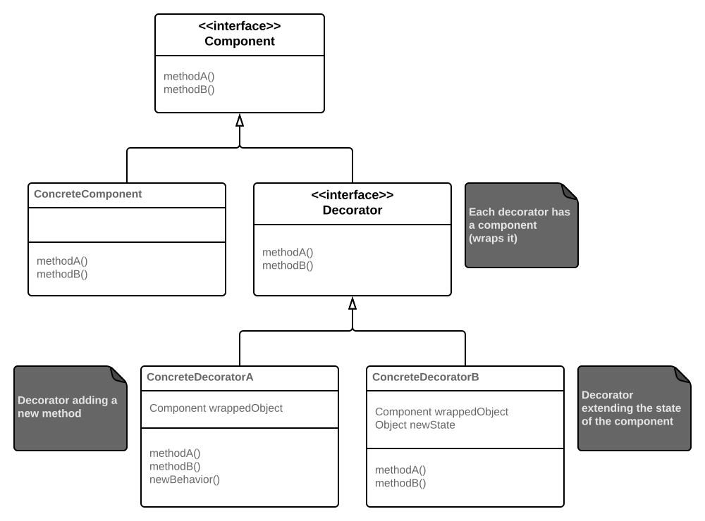
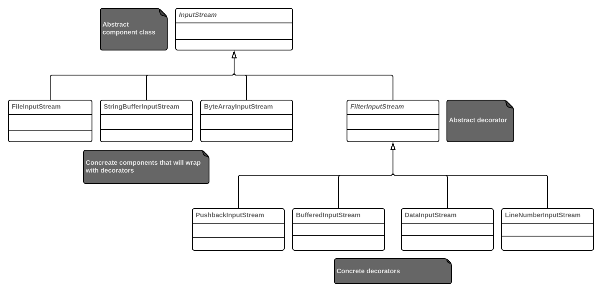

# Decorator Pattern

**Definition**: attaches additional responsibilities to an object dynamically. Decorators provide a flexible alternative to sublassing for extending functionality.

**Advantages**:
* enables to add its own behavior either before and/or after delegating to the decorated object to do the rest of the job;
* objects can be decorated at any time, dynamically, with as many decorators as we like;
* the decorators stand in place of the component and add new behavior and/or state.

**Facts**:
* using inheritance here may seem to break rules, but it is used for *type matching*; the decorators have to stand in place of the component;
* the inheritance is not used to get *behavior* - this comes through composition of decorators with the base components and other decorators;
* the component class can be either an interface or abstract class.

**Disadvantages**:
* decorator patterns often results in a lot of small classes to design;
* used uncarefully can increase complexity of the code;
* usually makes constructing objects more complicated - the compontent and decorators have to be instantiated.

## Decorators in Java I/O

