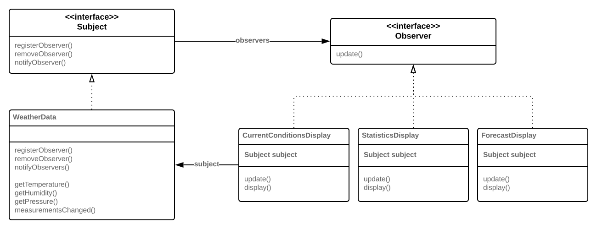
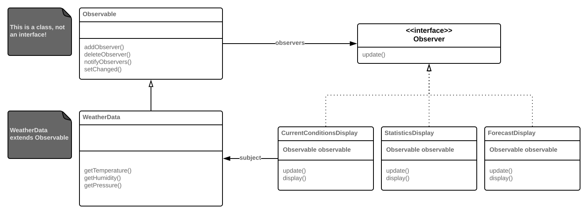

# Observer Pattern

## Most common approach

**Definition:**

**The observer pattern defines a one-to-many dependency between objects so that when one object changes state, all of its dependents are notified and updated automatically.**

**Facts**:
* The one-to-many means that there is one object that owns and controls the state, and there can be multiple observers.
* The dependency in the definition means that the subject is the sole owner of the data, the observers are dependent on the subject to update them when the data changes.

**Advantages - mainly loose coupling**:
* Subject knows only that an observer implements a certain interface.
* New observers can be added at any time.
* We never need to modify the subject to add new types of observers.
* We can reuse subjects or observers independently of each other.
* Changes to either the subject or an observer will not affect the other.

## Java built-in Observer Pattern

**Facts**:
* `Observable` is a class and every subject class must extend it, automatically inheriting the add, delete and notify Observer methods.
* To send notifications you must call `setChanged()` method and then call one of notification methods - `notifyObservers()` or `notifyObservers(Object arg)`.
* To receive notifications you must implement `update(Observable o, Object arg)` method.
* Without calling `setChanged()` the observers will not be notified; this is giving flexibility with the notification frequency should be sent.
* **Never depend on order of evaluation of the Observer notifications**.

**Two notification models**:
* Pull model - notifying with `notifyObservers()` and letting them pull the data  (*considered more correct*).
* Push model - notifying with `notifyObservers(Object arg)`.

**Disadvantages**:
* `Observable` is a class, this violates *program to an interface, not implementation rule*.
* `Observable` has to be subclassed and only one class can be extended at a time - this limits reuse potential.
* `Observable` method `setChanged()` is protected - it cannot be called unless it is subclassed; this means you can't create an instance of the Observable class and compose it with your own objects.
