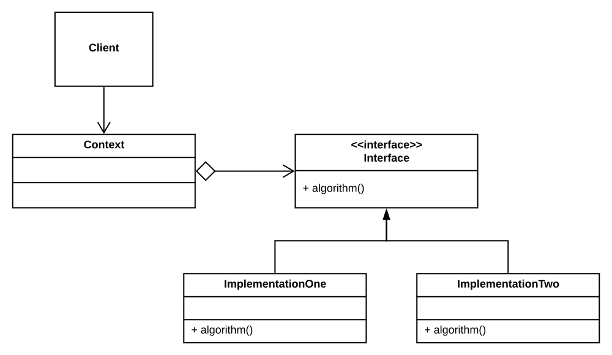
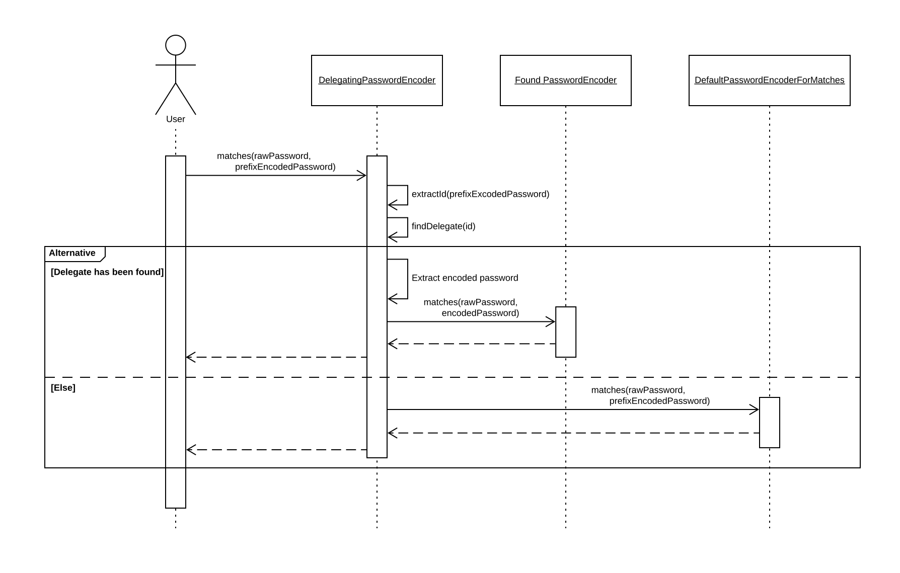

# Strategy Pattern

**Definition**:

The strategy patterns defines a family of algorithms, encapsulates each one, and makes them interchangeable. Strategy lets the algorithm vary independently from clients that use it.

**Advantages**:
* New behavior can be added without modifying any of the existing ones and without touching any of the client classes (**open for extension, closed for modification**).
* The client class delegates its behavior to the behavior class by having an object with right interface.
* No implementation details leak to the client class, it owns interface.
* The behavior (also called *algorithm*) can be changed dynamically.

**Rules used mostly**:
* Favor composition over inheritance.
* Encapsulate what varies.

## Example: Delegating Password Encoder

[Check the source code: `org.springframework.security.crypto.password.DelegatingPasswordEncoder`.](https://github.com/spring-projects/spring-security/blob/master/crypto/src/main/java/org/springframework/security/crypto/password/DelegatingPasswordEncoder.java)

**Encoding a password**:
1. Encode a raw password using `passwordEncoderForEncode`.
2. Prefix the password with an id of the encoder.
3. For example: `password` -> `Atjwi4*$@*$` -> `{encoder_id}Atjwi4*$@*$`

**Decoding a password**:
1. Extract the encoder id for the prefix.
2. Find an encoder basing on the id.
3. Remove the prefix from the matching encoded password and delegate matching to the found encoder.
4. If no prefix is found or the delegate cannot be found, fall back to the `defaultEncoderForMatches`.

**Strategy pattern here**:
* All encryption/decryption strategies are kept in a map and can be dynamically modified.
* Adding a new password encoder (extension) modifies neither the `DelegatingPasswordEncoder` nor the client code.

