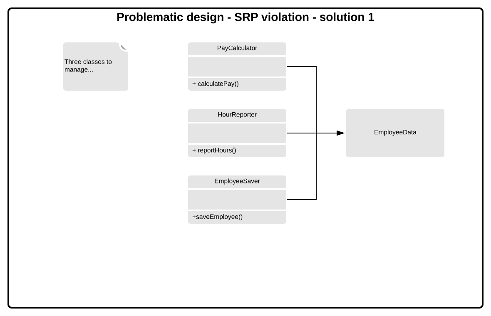
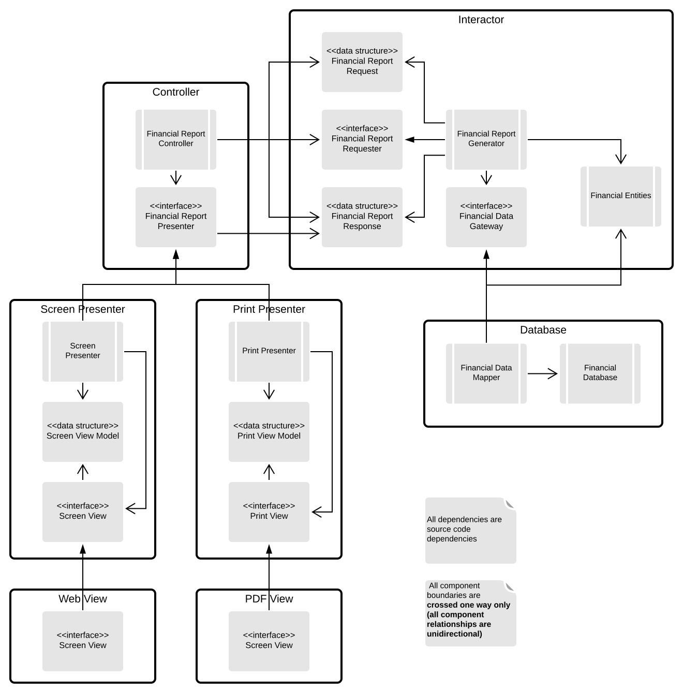

# SOLID

## Single Responsibility Principle
**A module should be responsible to one, and only one actor.** 

### Description
* *the class or module should have only one reason to change* by Robert Martin;
* usually `Manager`, `Utility`, `Context` classes are doing too much.

### Rationale
* software is easier to implement, debug and test;
* any change does not add/remove responsibilites from class;
* classes are easier to understand and explain;
* prevents unexpected side-effects of future changes;
* classes are easier to name clearly.

### Examples
* MVC pattern;
* chain of responsibility pattern;
* at component level - Common Closure Principle;
* at architectural level - Axis of Change responsible for creating Architectural Boundaries.

### Diagrams
#### Violation
Violation of SRP rule - implicit coupling of three actors (*reasons to change*).

#### Solution 1
Put all operations to separate classes. Drawback - three classes to manage.

#### Solution 2
Use facade to manage classses and delegate calls.

#### Solution 3
Make Employee class a partial facade:
* most important business function stays in the class close to data;
* rest of the functionality is reached via delegation (Employee class acts as a facade in these cases).

### Further reading
* [separation of concerns](https://en.wikipedia.org/wiki/Separation_of_concerns).

## Open/Closed Principle
**The code entities should be open for extension, but closed for modification.** 

### Description
The term originates from *Object Oriented Software Construction* by Bertrand Meyer.

A module is:
* **open** if it is still available for extension. For example it should be possible to add fields to  the data structres it contains. In object oriented programming, adding functionalities is mainly achieved by subclassing;
* **closed** if it is available for use by other modules. This assumes that the module has been given a well defined, stable description.

### Rationale
OCP for architect is for:
* separating the functionality based on how, why and when it changes;
* organizing the separated functionality into a hierarchy of compontents;
* protecting higher-level components in that hierarchy from changes to lower-level compontents.

### Example
* an **anti-example** could be `switch` statement that requires change every time you add an option to menu;
* strategy pattern.

### Use case

#### Summary
* software that displays a financial summary on a web page with negative values rendered in red;
* new requirement: make a printable report in black-and-white - negative values in parentheses.

#### Steps

##### Separate things that change for different reasons (SRP)
Applying SRP:
* there are two steps in the processing;
* simplified data-flow view can be made.

##### Organize the dependencies properly (DIP)
Organizing the source code dependencies:
* ensure that changes to one of the responsibilities do not cause changes in the other;
* ensure that the behavior can be extended without undo modification;
* partitioning processes into classes;
* separating classes into components.

Connections between classes/components are characterized in the following way:

A top view of components is the following:

Interactor is protected from changes because:
* it contains business rules;
* it contains the highest-level policies of the application;
* other components are dealing with peripheral concerns from the application point of view.

The same way as rest of the application is peripheral to *Interactor*:
* *Controller* is peripheral to *Interactor*, but central to *Presenters* and *Views*;
* *Presenters* are peripheral to *Controller*, but central to *Views*.

A hierarchy of protection based on the notion of "level" is created:
* *Interactors* are the highest-level concept, they are the most protected;
* *Views* are among the lowest-level concepts, they are the least protected.

Additionally, the following measurements are taken in the diagram:
* information hiding to protect from transitive dependencies;
* directional control to invert dependency.

### Further reading
* [Craig Larman, *Protected Variation: The Importance of Being Closed*](http://codecourse.sourceforge.net/materials/The-Importance-of-Being-Closed.pdf);
* [Robert C. Martin, *The Open-Closed Principle, C++ Report*](https://drive.google.com/file/d/0BwhCYaYDn8EgN2M5MTkwM2EtNWFkZC00ZTI3LWFjZTUtNTFhZGZiYmUzODc1/view).

## Liskov Substitution Principle (Sustainability)
**Objects in a program should be replaceable with instances of their subtypes without altering the correctness of that program.**

### Description
This is a definition of a subtyping relation called (strong) behavioral subtyping introduced by Barbara Liskov in a 1987 conference. It intends to guarantee **semantic interoperability of types in a hierarchy**.

#### Designing by contract
Each method should have *preconditions* and *postconditions* defined.
In the method execution:
* preconditions must hold true in order for it to execute;
* postconditions must hold true after the execution of a method;

When redefining a method (in a derivative):
* preconditions may be replaced by weaker ones;
* postconditions may be replaced by stronger ones.

This not only applies to making subclasses breaking the API of the super class, but also subclasses which implement the API in an unpredictable way:
* in mathematics `Square` is a `Rectangle`, so it could be a subclass;
* height and width of a Rectangle are independently mutable;
* height and width of a Square must change together;
* `User` who believes it is communicating with a `Rectangle` would get easily confused.

### Anti-examples

#### Strengthening preconditions
1. Base method accepts an int.
2. Derived requires that in to be positive (strenghtened precondition).
3. Code that worked perfectly fine before with a negative ints now is broken.

#### Weakening preconditions
1. Base method guarantees that the member would be positive after being called.
2. Derived changes the behavior to allow negative ints.
3. Code that worked on the object assuming that the post-condition is upheld is broken now.

### Further reading
* [Presentation by Liskov and Wing](./image/http://reports-archive.adm.cs.cmu.edu/anon/1999/CMU-CS-99-156.ps])
* [Robert C. Martin](./image/https://web.archive.org/web/20151128004108/http://www.objectmentor.com/resources/articles/lsp.pdf)

## Interface Segregation Principle
**Favor many, smaller, client-specific interfaces over one larger, more monolithic interface.**

### Description
* *clients should not be forced to implement interfaces they do not use* by Robert Martin;
* favor composition over inheritance - separate roles (resposibilities);
* favor decoupling over coupling - do not couple derivative classes with unneeded responsibilities inside a monolith.

### Rationale
Small iterfaces:
* are easier to utilize;
* are less prone to breaking.

### Example at code level

#### Problem

* `User1` uses only `operation1`, `User2` - `operation2` and `User3` - `operation3`;
* `User1` is dependent of `operation2` and `operation3` despite the fact that it does not use them;
* change of `operation2` or `operation3` in `OPS` will force `User1` to be recompiled and redeployed (**HOW?**).

#### Solution with ISP

* by seggregating the operations into interface, the source code of `User1` depends on `Operation1` interface and `operation1()`, but **will not** depend on `OPS`;
* change to `OPS` that `User1` does not care about will not cause `User1` to be recompiled and redeployed.

### Example at architectural level

### Further reading

## Dependency Inversion
**Write code that depends upon abstractions rather upon concrete details.**
**Write to an interface, not implementation.**

### Description
* *High level modules should not depend upon low level modules. Both should depend upon abstractions* by Robert C. Martin;
* *Abstractions should not depend upon details. Details should depend upon abstractions* by Robert C. Martin.

### Rationale
* improved reusability and extension (write to an universal API);
* enables Dependency Inversion.

### Example
* DI in Spring;
* switching database implementations.

### Further reading
* Design Patterns book.

## TODO
* dependence does not have to mean expicit code use - it means also one module has to be recompiled and redeployed if other is changed - how does it apply to CI and CD in Java? How does it impair these mechanisms?
