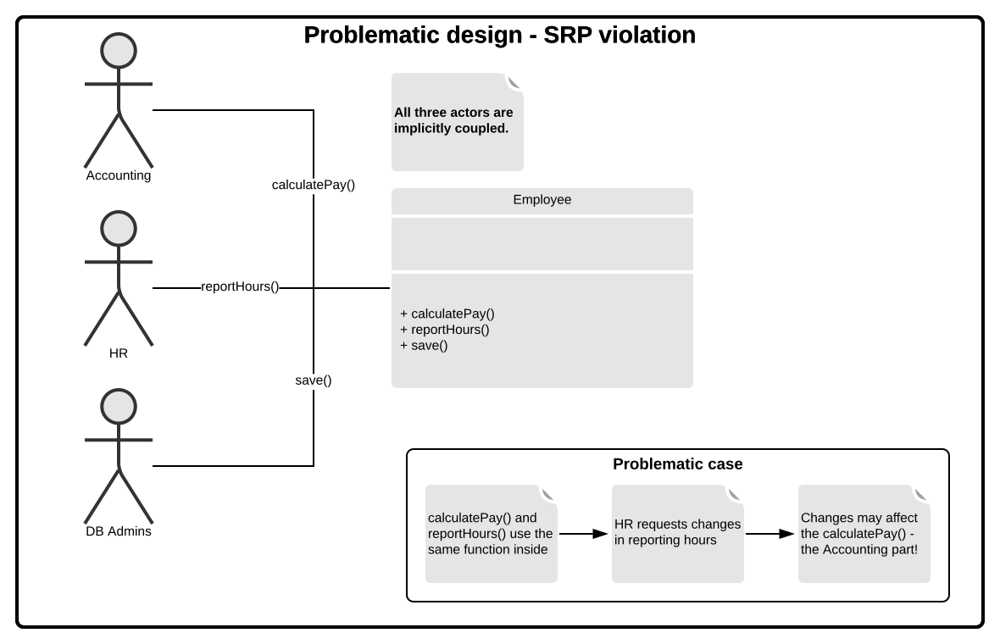
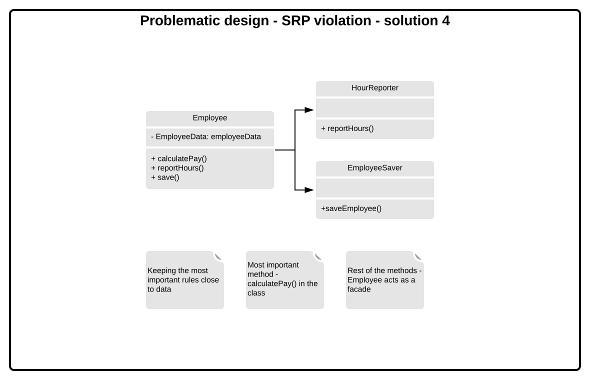

# SOLID

## Single Responsibility Principle
**A module should be responsible to one, and only one actor.** 

### Description
* *the class or module should have only one reason to change* by Robert Martin;
* usually `Manager`, `Utility`, `Context` classes are doing too much.

### Rationale
* software is easier to implement, debug and test;
* any change does not add/remove responsibilites from class;
* classes are easier to understand and explain;
* prevents unexpected side-effects of future changes;
* classes are easier to name clearly.

### Examples
* MVC pattern;
* chain of responsibility pattern;
* at component level - Common Closure Principle;
* at architectural level - Axis of Change responsible for creating Architectural Boundaries.

### Diagrams
#### Violation
Violation of SRP rule - implicit coupling of three actors (*reasons to change*).

#### Solution 1
Put all operations to separate classes. Drawback - three classes to manage.

#### Solution 2
Use facade to manage classses and delegate calls.

#### Solution 3
Make Employee class a partial facade:
* most important business function stays in the class close to data;
* rest of the functionality is reached via delegation (Employee class acts as a facade in these cases).

### Further reading
* [separation of concerns](https://en.wikipedia.org/wiki/Separation_of_concerns).

## 0pen/Closed Principle
**The code entities should be open for extension, but closed for modification.** 

### Description
The term originates from *Object Oriented Software Construction* by Bertrand Meyer.

A module is:
* **open** if it is still available for extension. For example it should be possible to add fields to  the data structres it contains. In object oriented programming, adding functionalities is mainly achieved by subclassing;
* **closed** if it is available for use by other modules. This assumes that the module has been given a well defined, stable description.

### Rationale
* 

### Example
* an **anti-example** could be `switch` statement that requires change every time you add an option to menu;
* strategy pattern.

### Further reading
* [Craig Larman, *Protected Variation: The Importance of Being Closed*](http://codecourse.sourceforge.net/materials/The-Importance-of-Being-Closed.pdf);
* [Robert C. Martin, *The Open-Closed Principle, C++ Report*](https://drive.google.com/file/d/0BwhCYaYDn8EgN2M5MTkwM2EtNWFkZC00ZTI3LWFjZTUtNTFhZGZiYmUzODc1/view).

## Liskov Substitution Principle (Sustainability)
**Objects in a program should be replaceable with instances of their subtypes without altering the correctness of that program.**

### Description
This is a definition of a subtyping relation called (strong) behavioral subtyping introduced by Barbara Liskov in a 1987 conference. It intends to guarantee **semantic interoperability of types in a hierarchy**.

#### Designing by contract
Each method should have *preconditions* and *postconditions* defined.
In the method execution:
* preconditions must hold true in order for it to execute;
* postconditions must hold true after the execution of a method;

When redefining a method (in a derivative):
* preconditions may be replaced by weaker ones;
* postconditions may be replaced by stronger ones.

### Rationale

### Anti-examples

#### Strengthening preconditions
1. Base method accepts an int.
2. Derived requires that in to be positive (strenghtened precondition).
3. Code that worked perfectly fine before with a negative ints now is broken.

#### Weakening preconditions
1. Base method guarantees that the member would be positive after being called.
2. Derived changes the behavior to allow negative ints.
3. Code that worked on the object assuming that the post-condition is upheld is broken now.

### Further reading
* [Presentation by Liskov and Wing](http://reports-archive.adm.cs.cmu.edu/anon/1999/CMU-CS-99-156.ps])
* [Robert C. Martin](https://web.archive.org/web/20151128004108/http://www.objectmentor.com/resources/articles/lsp.pdf)

## Interface Segregation Principle
**Favor many, smaller, client-specific interfaces over one larger, more monolithic interface.**

### Description
* *clients should not be forced to implement interfaces they do not use* by Robert Martin;
* favor composition over inheritance - separate roles (resposibilities);
* favor decoupling over coupling - do not couple derivative classes with unneeded responsibilities inside a monolith.

### Rationale
Small iterfaces:
* are easier to utilize;
* are less prone to breaking.

### Example
* at a larger scale - microservices.

### Further reading

## Dependency Inversion
**Write code that depends upon abstractions rather upon concrete details.**
**Write to an interface, not implementation.**

### Description
* *High level modules should not depend upon low level modules. Both should depend upon abstractions* by Robert C. Martin;
* *Abstractions should not depend upon details. Details should depend upon abstractions* by Robert C. Martin.

### Rationale
* improved reusability and extension (write to an universal API);
* enables Dependency Inversion.

### Example
* DI in Spring;
* switching database implementations.

### Further reading
* Design Patterns book.