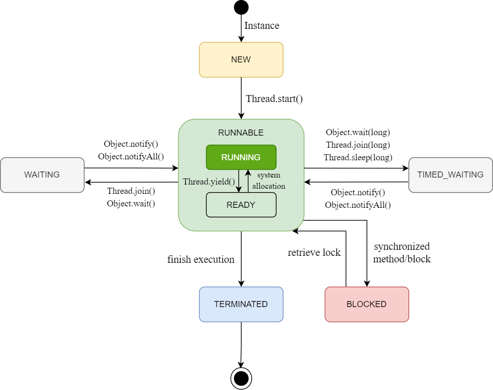

(Check this repository first)[https://github.com/arialdomartini/Back-End-Developer-Interview-Questions]

## JVM

<details>
<summary>JVM.1 What is the role of JVM?</summary>
JVM is short for Java Virtual Machine. It provides a runtime environment for Java code to run in. It makes sure that Java is compiled once and runs everywhere regardless of operating systems and processors.
</details>

<details>
<summary>JVM.2 How is the compilation process of Java source code?</summary>
Java source code undergoes source code development -> lexical analyzer -> syntax analyzer -> sematic analyzer -> bytecode generator.
</details>

<details>
<summary>JVM.3 What is the structure of JVM?</summary>
JVM consists of mainly three subsystems: Class Loader subsystem, Runtime Data area, and Execution Engine [check here](https://dzone.com/articles/jvm-architecture-explained).
</details>

<details>
<summary>JVM.4 What is the process of loading a Java class?</summary>

1. Load the bytecode file.
2. Verify whether the bytecode is machine safe.
3. Prepare memory for local variables, initial values in the method area.
4. Resolve the symbol references in the constant pool to direct references.
5. Initialize the class by executing the class source code.
</details>

<details>
<summary>JVM.5 How many bytes does an object take in Java?</summary>

The minimum object size is 16 bytes for modern 64-bit JDK since the object has a 12-byte header, padded to a multiple of
8 bytes.
</details>

<details>
<summary>JVM.6 What’s the difference among String, StringBuffer and StringBuilder?</summary>
String class has private final char array in its implementation. Furthermore, it has no inner methods such as append() to modify the content of the stored values. Every modification such as addition generates a new String in the constant pool. Hence, a String instance is immutable.

StringBuilder and StringBuffer both extend from AbstractStringBuilder class. In AbstractStringBuilder, it also stores
the value in the char sequence in char[] value but it is not decorated by final keyword. So, the two instances are
mutable.

In terms of thread safety, String instance is immutable so it is thread-safe. StringBuffer adds a synchronized lock to
its inherited methods so it is also thread-safe whereas StringBuilder does not apply synchronized locks so it is
thread-unsafe.

In summary, to operate a limited number of data, use String. To operate a large number of char sequence in a
single-threaded program, use StringBuilder. To operate a large number of char sequence in a multi-threaded program, use
StringBuffer.
</details>

<details>
<summary>JVM.7 What is a JIT compiler?</summary>

</details>

<details>
<summary>JVM.8 Polymorphism, abstraction, encapsulation</summary>
</details>

<details>
<summary>JVM.9 Types of polymorphism</summary>
</details>

## Java - general

<details>
<summary>JAVA.1 What are the differences between interface and abstract class?</summary>

The default access for interface methods is public. All methods in an interface do not have implementations but an
abstract class can have implementations.
In an interface, there can’t be any other variables other than static or final. But an abstract class does not have
these restrictions.
A class can implement multiple interfaces but can extend only one abstract class.
In the aspect of system design, an abstract class is more like a template for designing a class whereas interface
targets method behavior.
</details>

<details>
<summary>JAVA.2 What are the differences between == and equals()?</summary>
</details>

<details>
<summary>JAVA.3 Method equals() and hashCode() contract</summary>
</details>

<details>
<summary>JAVA.4 Coding task 1</summary>
You have these variables

```
String a = “abc”;
String b = “abc”;
String c = new String(“abc”);
String d = String.valueOf(c);
```

What are the results of the following calculations:

```
a==b;
a==c;
c==d;
a.equals(b);
a.equals(c);
```

<details>
<summary>Answer</summary>

The `String#valueOf()` calls `Object#toString()` if the argument is not null.
True: 1, 3, 4, 5

</details>
</details>

<details>
<summary>JAVA.5 Coding task 2 Application handling accounts and customers</summary>

Task:
1. There are customers and accounts with one-to-one mapping
2. Application has to handle depositing money and exchanging
3. Suggest the steps to develop the application
4. The application should be simple

<details>
<summary>Answer</summary>

1. TDD approach.
2. Clear separation between layers.
3. Using @Transactional clearly stated, describe how important it is to rollback whole transaction.
4. Suggesting adding currencies.

</details>

</details>

<details>
<summary>JAVA.6 How to avoid serializing some data in the class?</summary>

The transient keyword in Java is used to avoid serialization. It is only used for variables. If any field of a data structure is defined as a transient, then it will not be serialized.
</details>

<details>
<summary>JAVA.7 What is a Marker Interface?</summary>
</details>

<details>
<summary>JAVA.8 What is Object Cloning?</summary>
</details>

<details>
<summary>JAVA.9 Define Wrapper Classes in Java.</summary>
</details>

<details>
<summary>JAVA.10 Define Singleton Classes in Java. How do you define them?</summary>
</details>

## Multithreading

<details>
   <summary>MULTITHREADING.1 In JVM Runtime Data Area, what are the components that are shared between multiple threads?</summary>
Method area is shared among threads. Heap area stores global variables, object instances, and things that could be accessed anywhere within the application. Therefore, heap area is also a shared space. The stack area which stores the methods, local variables within a thread is not shared as each thread has different methods of calling and variables. PC register tracks the command on how the thread should progress so it is independent for each thread as well. Native method stack is similar to stack area which also contains local variables and methods. So native method stack is not shared across multiple threads.
</details>
<details>
<summary>MULTITHREADING.2 What are the communication methods between threads in Java?</summary>

1. Shared memory: volatile keyword, synchronized keyword
2. The wait and notify mechanism: `wait()` and `notify()` are the methods of Java Object. `wait()` method makes object
   convert from running state to blocking state. Once a certain condition fulfills, another thread will call
   the `notify()` method to wake up the first thread, and let it enter a runnable state.
3. Lock/Condition mechanism: `Lock` is class provided by Java to limit access to an object. `Condition` is invoked
   by `Lock` class. One lock can create multiple conditions. Using `Condition.await()` and `Condition.signal()` methods,
   we can put a thread to sleep or wake up a thread to do its work.

</details>
<details>
<summary>MULTITHREADING.3 What are volatile and synchronized keywords?</summary>
Volatile keyword targets at a field, or a variable in a method, such that when multiple threads access the same variable, data consistency is ensured. This is done by forcing the variable to be accessed through main memory instead of cache memory.

Synchronized keyword is used for a block of code. It allows only one thread to access the resources at a given point of
time. When one thread is manipulating the resources, other threads who want to access the same object are not allowed to
execute.

**Check the Java Zaawansowana training notes.**
</details>
<details>
<summary>MULTITHREADING.4 What are the differences between volatile and synchronized?</summary>
Volatile is a lightweight lock whereas synchronized is a heavyweight lock. After synchronized block is writing/modifying the resource, the variable value is flushed back to the shared memory space. This causes concurrency issue as threads on the same object protected by synchronization can’t execute concurrently. In contrast, volatile allows concurrent executions from multiple threads by forcing them to read the variable from main memory directly instead of CPU cache. Moreover, synchronized is implemented based on operating system which causes the thread to fall into the kernel mode instead of user mode which is a time-consuming process.
</details>
<details>
<summary>MULTITHREADING.5 What is the use of ThreadLocal?</summary>
ThreadLocal is a mechanism to ensure thread safety. It allows developer to store variables pertaining to a particular thread so that multiple threads do not need to access shared variables, causing hazard to data consistency.
Each Thread class has a field called threadLocals of type ThreadLocal.ThreadLocalMap. The key for threadLocals is the reference to the current ThreadLocal and the value is the variable developer wants to store (of class type T). To write to or read from the variable, ThreadLocal.get() or set() method are called.
</details>
<details>
<summary>MULTITHREADING.6 What is reflection in Java?</summary>
Java is a static language. Reflection in Java gives the program ability to introspect itself, making it more dynamic. It allows developer to examine or modify the behavior of methods, classes or interfaces at runtime.
</details>
<details>
<summary>MULTITHREADING.7 Why is HashMap thread-unsafe?</summary>

1. Multiple puts from multiple threads may cause the loss of the element
2. When put and get execute concurrently, the return value for get may be null. This happens when a thread puts an
   element which exceeds threshold, leading to a rehash operation, a get method will lead to null value.
3. Concurrent put in jdk1.7 may lead to circular linked list which causes infinite loop in get.
   To make sure thread-safety, use ConcurrentHashMap instead.

</details>
<details>
<summary>MULTITHREADING.8 What are the differences between thread and process?</summary>
Thread is a small unit within a process. A process can have multiple threads. A process is an executing program but a thread is a part of the program. Each process has its own address space which multiple threads within that process share. A process is a heavyweight task but a thread is a lightweight task.
</details>
<details>
<summary>MULTITHREADING.9 Explain what is ReentrantLock?</summary>
ReentrantLock is a lock where a process can claim the lock multiple times without blocking on itself. If a lock is non-reentrant, when you grab it the second time, you will be blocked by yourself which effectively causes a deadlock.
</details>
<details>
<summary>MULTITHREADING.10 Explain what is ThreadPool and how does it benefit an application?</summary>
Creating and starting a thread can be an expensive process in JVM. By repeating this process every time we need to execute a task, we’re incurring a significant performance cost. A thread pool in Java encompasses a number of threads that are executed when needed and returned to the pool after execution for reuse later. A threadpool consists of the pool of worker threads, a thread factory producing new threads, and a queue of tasks to be executed. A threadpool helps to improve the performance of the application.
</details>
<details>
<summary>MULTITHREADING.11 What are the differences between optimistic and pessimistic locks?</summary>
Optimistic lock implements CAS algorithm (Compare-And-Swap). Before it updates the new value to the target resource, it will check if the target value matches the expected value it retrieved earlier. If match, no threads have modified it and it proceeds to change the target value to the new value. If not, it will read the target value again and perform CAS until finishing with the update.

Pessimistic lock means the thread will lock the resource for exclusive use such that other threads are unable to access
it at the same time. Synchronized keyword is a pessimistic lock. Compared to optimistic lock, the level of concurrency
is reduced.
</details>
<details>
<summary>MULTITHREADING.12 Is optimistic lock always better?</summary>
Depends on the situation. If multiple threads are waiting to fetch the state of the object, it will cause high occupancy on the CPU. CAS algorithm has another pitfall where when the target value changes from “A” to “B” then to “A”, the lock will treat it as no change. One solution is to use version control on the target value.
</details>
<details>
<summary>MULTITHREADING.13 What are the basic states of a thread?</summary>

1. NEW: The thread instance is newly created.
2. RUNNABLE: RUNNBALE has both READY and RUNNABLE states. When start() is invoked, the thread goes into READY state to wait for the system to allocate a timeslice. 
3. RUNNING: The CPU allocates the time slice to the thread so the thread can execute. 
4. BLOCKED: The thread is blocked when it tries to access some resource but the lock of that resource is acquired by other threads. 
5. WAITING: The thread goes into waiting for the state until other threads notify or interrupt so it can re-enter Runnable state.
6. TIMED_WAITING: The thread goes into TIME_WAITING when the program puts a maximum timeout on the thread.
7. TERMINATED: The thread finishes and exits.



</details>
<details>
<summary>MULTITHREADING.14 Why does it execute run() when we call start() instead of calling run() directly?</summary>

start() allows the thread to enter into a Runnable state. When the thread gets allocated time slice by CPU, the thread will then execute. If we call run() directly, the code will be executed as a normal method under the main() thread. It will not be executed as a separate thread, defeating the purpose of multi-threading.
</details>
<details>
<summary>MULTITHREADING.15 How can synchronized keyword be used?</summary>

1. synchronized can be used to decorate an instance method. Before code executes, it needs to retrieve the lock of the instance.
2. synchronized can decorate static methods. It needs to retrieve the lock of the class.
3. synchronized can decorate a code block. synchronized(object) adds a lock to the instance. synchronized(object.class) adds a lock to the class.

</details>
<details>
<summary>MULTITHREADING.16 How can keyword final be used?</summary>

1. final keyword can be applied to variables, classes, and methods.
2. final variable: Once the variable has been set to some value, it cannot be modified.
3. final class: If a class is defined by final, other classes cannot extend from it.
4. final method: A final method cannot be overridden.

</details>
<details>
<summary>MULTITHREADING.17 Why prefer immutable classes?</summary>
</details>
<details>
<summary>MULTITHREADING.18 What is a deadlock?</summary>
Two or more threads are blocked forever, waiting for each other to release their acquisition of the commonly shared resources.

**TODO: Make deeper, create test cases.**
</details>
<details>
<summary>MULTITHREADING.18 Avoiding deadlock code task</summary>

```
// How to avoid this deadlock?

private final Object resource1 = new Object();
private final Object resource2 = new Object();

Thread threadOne = new Thread(()->{
        synchronized (resource1){
            ...
        };
        synchronized (resource2){
            ...
        }
});

Thread threadTwo = new Thread(()-> {
     synchronized (resource2){
            ...
     };
     synchronized (resource1){
            ...
     }
});
threadOne.start();
threadTwo.start();
```

<details>
<summary>Answer</summary>

1. Reverse the access to the resources.
2. Replace with global lock instead?

</details>
</details>

<details>
<summary>MULTITHREADING.19 Compare sleep() and wait().</summary>

* Both can stop the execution of threads. 
* sleep() does not release lock but wait() releases the lock 
* After wait() is invoked, threads will not wake up automatically, it needs other threads on the same instance to call notify() or notifyAll(). After sleep() is executed, threads will wake up automatically. Therefore, wait() is usually used for inter-communication between threads whereas sleep() is used to halt thread execution.
</details>

<details>
<summary>What are the differences between Executor.execute() and ExecutorService.submit()?</summary>

execute() submits tasks that do not need to return anything so we aren’t able to identify whether a task has been successfully executed or not.

```
void execute(Runnable command);
```

submit() returns the task which needs a return value. The Future instance will help to identify whether the task has been successfully executed or not using Future.get() method.

```
<T> Future<T> submit(Callable<T> task);
```
</details>

<details>
<summary>MULTITHREADING.20 What is the Daemon Thread?</summary>
</details>

## Security

<details>
<summary>SEC.1 How are passwords stored?</summary>
</details>

https://www.fullstack.cafe/blog/backend-developer-interview-questions
https://www.edureka.co/blog/interview-questions/java-interview-questions
https://www.toptal.com/java/interview-questions
https://arc.dev/developer-blog/java-interview-questions/
https://codeburst.io/review-these-50-questions-to-crack-your-java-programming-interview-69d03d746b7f
https://www.ideamotive.co/backend/interview
https://www.javatpoint.com/full-stack-developer-interview-questions-java

## Soft

1. What do you think contributes to a successful project?
2. How do you keep up with the latest technologies and trends?
3. Tell me about a time when you had to work with someone difficult? How did you handle it?
4. What is the most difficult change you’ve encountered in your career?
5. How do you handle situations where there is a lot of tension between you and a colleague? 
6. Tell us about a time when you received criticism about your work and how you handled it. 
7. If you have to deliver negative feedback to members of your development team, how would you do it? 
8. Tell me about your favorite development project to date and what it was like from start to finish. 
9. What is your experience with GoTo, and do you prefer structured programming? 
10. Tell me about the largest web application you have ever worked on? What coding were you responsible for? 
11. What's your preferred type of development environment?
12. Which programming languages do you want to work with and why?