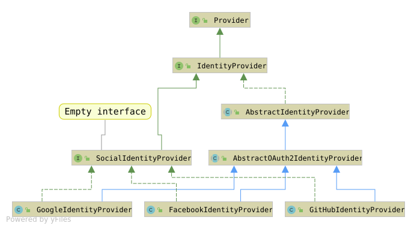

# Abstract Class Compared to Interfaces

Similarities:

* Cannot be instantiated.
* May contain a mix of methods declared with or without an implementation.

In abstract class:

* You can declare fields that are not static and final.
* You can define abstract methods that are not private. Still, you can define none of them.
* You can define public, protected and private concrete methods.

In interface:

* All fields are automatically public, static and final.
* Abstract, default and static methods are implicitly public. Private methods are allowed from Java 9. Interface methods
  can never be protected or package-private.
* Interface can extend many interfaces.
* Since Java 8:
    * You can declare `static` methods. They are not inherited, you call them as `SomeInterface.foo()`.
    * You can declare `default` methods.
        * If two interfaces provide the same default method, the class must override it.
        * "Class wins" - a method from a superclass beats an interface default.
* Since Java 9:
    * You can declare `private` instance methods, which must have a body.
    * You can declare `private static` methods.
* Since Java 16/17:
    * `record` and `enum` classes can implement interfaces.

**You can extend only one class; you can implement many interfaces.**

When to use abstract class:

* Sharing code between two **closely related classes**.
* Declaring non-static and non-final fields.
* Classes that extend the abstract class have many common methods or fields.
* Classes that extend the abstract class require access modifiers package-private, protected.

When to use interface:

* **Unrelated classes** would implement the interface (eg. `Comparable` and `Cloneable`);
* Specifying a behavior but not thinking about who implements it.
* Enabling multiple inheritance of type.

## Example from Keycloak

* Concrete identity providers (there are only a few on the diagram) extend the `AbstractOAuth2IdentityProvider` - their
  behavior is strictly related.
* `SocialIdentityProvider` is an empty interface extending `IdentityProvider` to mark identity providers that are based
  on social network pages.
