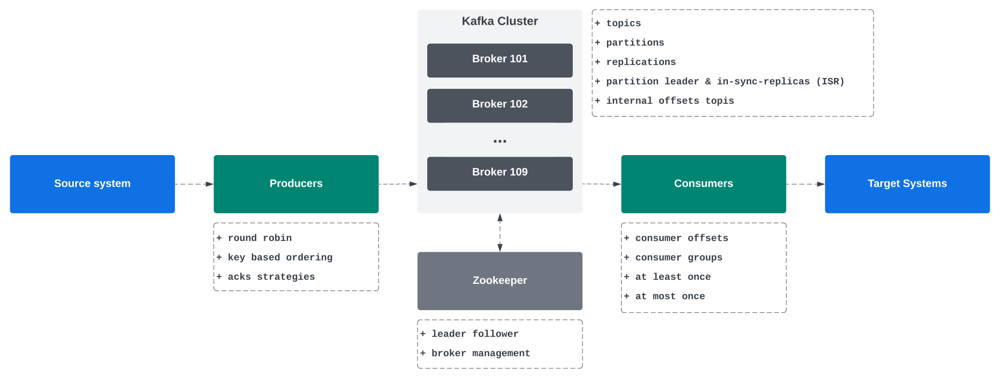
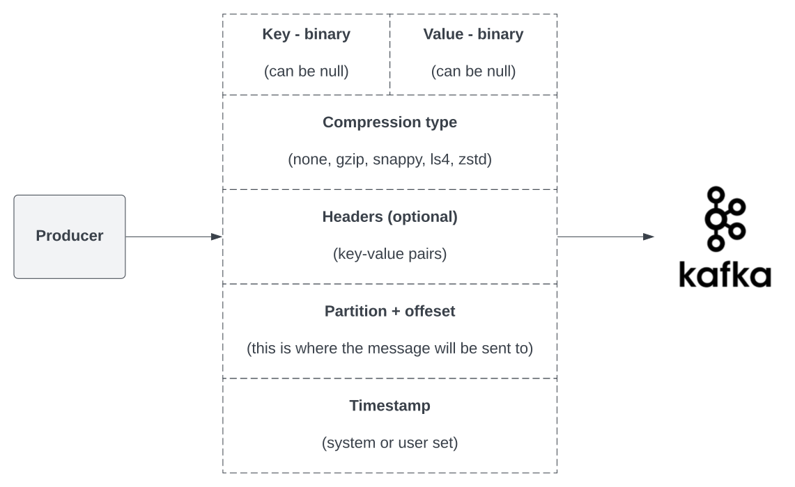

# Kafka



### Problem to solve

Many programs need to integrate between various systems (ETL).
When there are n-systems on one side and m-systems on another, you can end up with n*m integrations to implement and maintain.

Kafka makes it easier, **it decouples data streams & systems**:
* **source systems** create (produce) the data and put it to Kafka.
* **target systems** receive (consume) the data from Kafka.

Use cases:
* Messaging system.
* Activity tracking.
* Gathering metrics from different locations.
* Application logs processing.
* Streams processing (with the Kafka Streams API for example).

### Topic

Topic is a stream of data.

* It is like the table in the database (without all the constraints).
* Identified by the **name**.
* Any kind of message format.
* The sequence of messages is called **data stream**.
* You cannot just query topics. Use `Kafka Producers` to send the data and `Kafka Consumers` to read the data.
* Data in Kafka is kept for limited time (default is one week, it is configurable).

### Partitions and offsets

Topics are split into partitions.

* Messages within each partition are ordered within partition.
* Each message within partition gets an incremental ID, called **offset** (0, 1, 2, 3...).
* **Kafka topics are immutable, once data is written to a partition, it cannot be changed.**
* Offset has a meaning only within a specific partition, but it is not re-used (even if the data is cleared, the IDs increase).
* Data is assigned to a partition randomly unless a key is provided.

### Producers

Producers write data to topics (which are made of partitions).

* Producers know to which partition to write to (and which Kafka broker has it).
* In case of Kafka broker failures, Producers will automatically recover.
* This is how scalability is achieved - topic is divided into partitions, one or many producers put messages in each partition.

### Message keys

Producers can send a key with the message (string, number, binary, etc.)

* If `key = null`, data is sent round-robin (partition 0, then 1, then 2...).
* If `key != null`, then all the messages with that key will go to a specific partition (uses hashing for this).
* Keys are typically sent if you need message ordering for a specific field (ex. `truck_id`).

### Kafka message

Kafka accepts only bytes as input and will output bytes.



* You need a serializer for both the key and the value.
* Kafka comes with a set of Common Serializers.

### Kafka message key hashing

The Kafka Partitioner takes a record and determines which partition to send it into.

* The process of determining the mapping of a key to the partition is the **Key Hashing**.
* In the default Kafka Partitioner, the keys are hashed using the murmur2 algorithm.

```
targetPartition = Math.abs(Utils.murmur2(keyBytes)) % (numPartitions - 1);
```

### Consumers

Consumers read the data from a topic identified by a name (**pull model**).

* Consumers can read from one to many partitions.
* Consumers automatically know which broker to read from.
* In case of broker failures, consumers know how to recover.
* Data is read in order from lower to higher offsets **within each partition**. So if consumer reads from many partitions, the order is maintained **only within each partition**. There is no ordering guarantee across partitions.
* Consumers use deserializers to transform binary key and value into objects/data.
* Kafka comes with a set of Common Deserializers.
* **The type of data does not change during the topic lifecycle.** You usually create a new topic instead.

### Consumer Groups

All the consumers in an application read data as consumer groups.

* Each consumer within a group reads from one or more distinct partitions. This means that they **do not share partitions**.
* If you have more consumers than partitions, some of them will be inactive (this is normal).
* You can have multiple consumer groups on the same topic (eg. multiple services reading from the events topic).
* To create distinct consumer groups, use the consumer property `group.id`.

### Consumer Offsets

The consumer offsets are recorded by Kafka to know, how far is each consumer group in each topic.

* When a consumer in a group has processed data received from Kafka, it should be **periodically** commiting the offsets. This makes the Kafka broker write to `__consumer_offsets` topic.
* If a consumer dies, it is able to read back from where it left off thanks to the comitted consumer offsets.

### Delivery semantics

By default, Java Consumers will automatically commit offsets (at least once).  If want you do this manually, you can choose:

* At least once (usually preferred):
  * Offsets are committed after the message is processed.
  * If the processing goes wrong, the message is read again.
  * There can be duplicate processing of a single message, so make sure the processing is **idempotent**.
* At most once:
  * Offsets are committed as soon as the message is received.
  * If something goes wrong, some messages are lost (received, but not processed, will not be read again).
* Exactly once:
  * For [Kafka -> Kafka] workflows: use Transactional API (easy with Kafka Streams API).
  * For [Kafka -> External System] workflows: use an **idempotent** consumer.

### Kafka Brokers

Broker is a server. A Kafka cluster is composed of multiple brokers.

* Each broker is identified with its ID (integer).
* Each broker contains certain topic partitions.
* After connecting to any broker (called a bootstrap broker), you will be connected to the entire cluster (Kafka clients have smart mechanics for that).
* Good number to start is 3 brokers; big clusters have over 100 brokers.
* So data is spread by brokers. This is the horizontal scaling in Kafka.

### Kafka Broker Discovery

Every Kafka broker is also called a "bootstrap server".

* You need to connect to one broker, Kafka clients will know how to be connected to the entire cluster (smart clients).
* Each broker knows about all brokers, topics and partitions (metadata).

Steps:

1. Kafka client connects to one of the Brokers with a Metadata Request.
2. The Broker returns a list of all brokers, which broker has which partition etc.
3. The client connects to the right broker to produce or consume data.

### Writing and reading data

* The producer needs to provide the Kafka client with any broker from the cluster and topic name. The Kafka Client will route the data to the appropriate brokers and partitions.
* The consumer needs to provide the same - any broker to connect to and the topic name. The rest will be covered by the Kafka itself.


### Kafka Topic Replication Factor

Topics should be stored at more than one Kafka broker.

* The replication factor should be > 1 (usually between 2 and 3).
* If a broker is down, another broker can serve the data.
* Brokers are replicating data from other brokers.
* For each partition, there is only ONE broker that is the **leader**.
* Other brokers can replicate the data and are called **ISR** (in-sync replica).
* Producers can only send data to the broker that is leader of partition.
* (By default) Consumers can only read from the leader of partition. However, since Kafka 2.4, it is possible to configure consumers to read from the closest replica.

### Producer Acknowledgements (ACKs)

Producer can choose to receive acknowledgement of data writes:

* `acks = 0`: Producer won't wait for acknowledgement (possible data loss).
* `acks = 1`: Producer will wait for leader acknowledgement (limited data loss).
* `acks = all`: Producer will wait for acknowledgements from all - leaders and replicas (no data loss).

### Topic Durability

The topic durability is strongly linked with the chosen replication factor.

* For a topic with replication factor of 3, the topic can withstand the loss 2 brokers.
* For replication factor of N, we can permanently lose up to N-1 brokers and still have the data.

### Zookeeper

Zookeeper is the software used to manage brokers. In Kafka 4 it will be removed.

* Zookeeper manages brokers (keeps a list of them).
* Zookeeper helps in performing leader election for partitions (one leader dies -> another is elected).
* Zookeeper sends notifications to Kafka in case of changes (eg. new topic, broker dies, broker comes up, deleting topics, etc.).
* Zookeeper by design operates with an odd number of servers (1, 3, 5, 7).
* Zookeeper has a leader (writes); the rest of servers are followers (reads).
* **Zookeeper does NOT store consumer offsets since Kafka v0.10, they are stored in a separate, internal topic.**

Kafka versions:

* Kafka 2.x can't work without Zookeeper.
* Kafka 3.x can work without Zookeeper (KIP-500) - using Kafka Raft.
* Kafka 4.x will not work with Zookeeper.

### Using Zookeeper

**Kafka Brokers still use Zookeeper until Kafka version 4.0.**

**Kafka Clients (consumers, producers, administration clients) have been migrated to use the brokers as the connection endpoint. They should not use Zookeeper.**

* Since Kafka 0.10, the consumers store the offset in Kafka, not Zookeeper.
* Since Kafka 2.2, the `kafka-topics.sh` CLI command references Kafka brokers, not Zookeeper for topic management.
* **Zookeeper is less secure than Kafka.**
* **Zookeeper ports should only be opened to allow traffic from Kafka brokers, not the Kafka clients.**
* Zookeeper has some scaling issues when Kafka clusters have > 100,000 partitions.

### Raft Protocol

This protocol has been introduced to allow removing Zookeeper as a dependency.

* Quorum Controller - one of the brokers is the Quorum Leader.
* Everyone (brokers, clients) connect to the brokers, there is no software managing this (like Zookeeper).