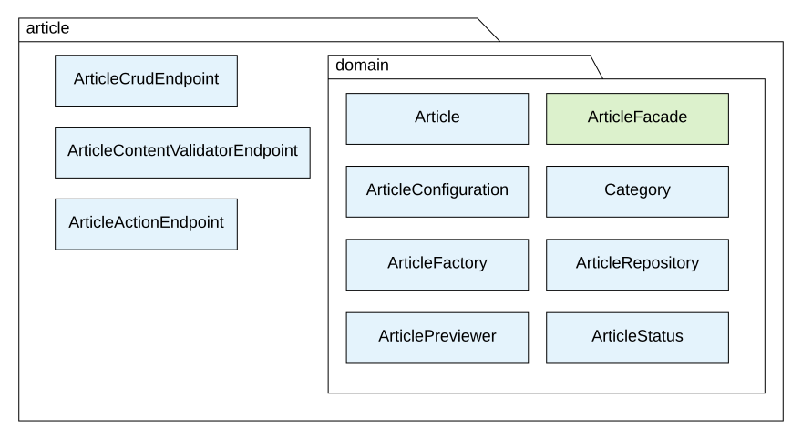
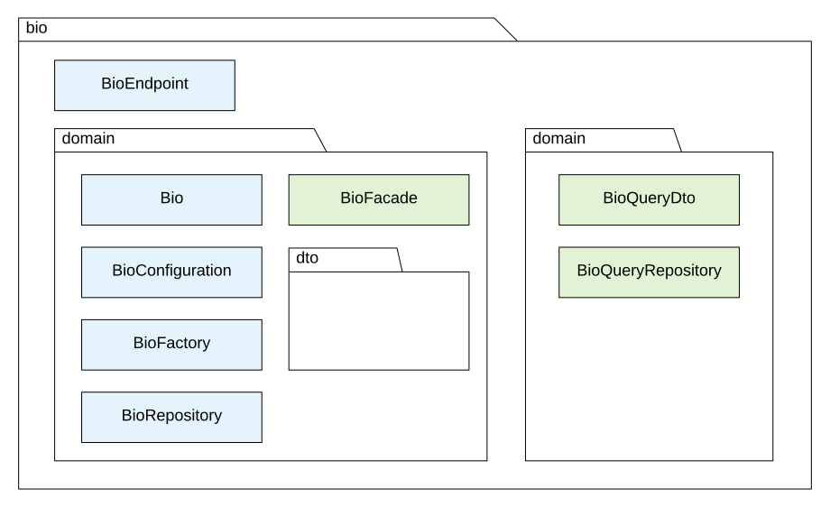
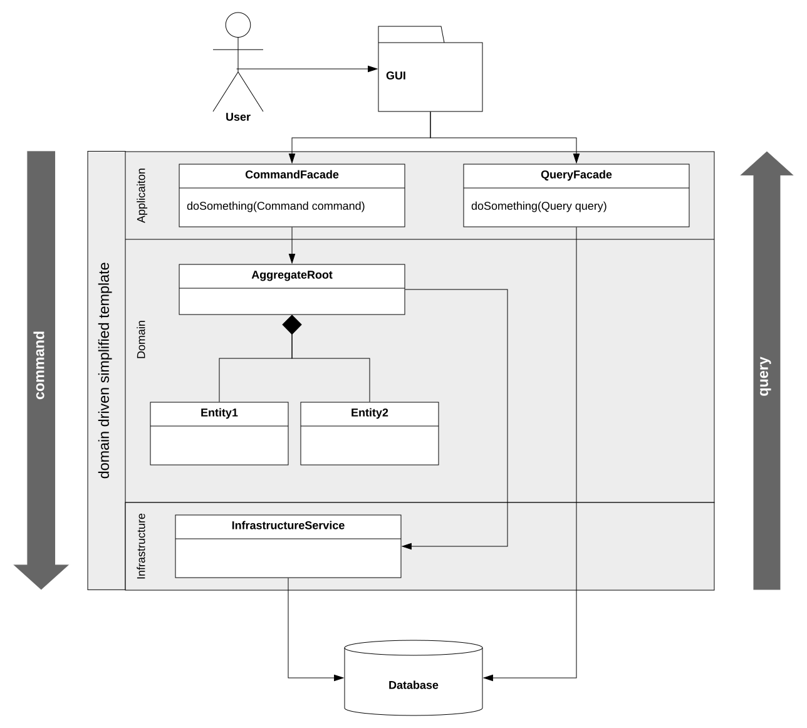

# Java building blocks - Jakub Nabrdalik presentation notes

## Idea behind building blocks

The crucial thing in programming does not involve algorithms, programming languages, data-structures - these are only utilities. The crucial thing is to limit our own mind to a problem of a certain complexity.

**This way, programming is about building blocks which are easy to use and easy to understand.**

Sizes of building blocks:
* large scale - many kloc - maven/gradle modules, jars, microservices - **easy**;
* small scale - a few hundred lines - private methods, nested classes - **easy**;
* medium scale - between a few hundred and a few thousand lines - **hard**.

Problem:
The medium scale building blocks are the most complicated and misunderstood.

Solution:
**Java package scope.**

### An average project

Packages in an average Spring Boot project:
* repository;
* service;
* controller;
* model;
* util;
* web.

Advantages:
* it is easy to imagine what is a target package for a new class;
* it is widely seen (not an advantage really).

Disadvantages:
* this way you cannot use package scope - you have to use public scope;
* this does not lead to building mid-sized, easy to comprehend building blocks.

## Buidling blocks utilizing package scope

### Example structure




This is a better way because:
* one public class in package - the entry point is clear;
* when one uses a package like this, they are interested only in one public class;
* you can focus on testing the interface - the only public class;
* it is easier to refactor, change, move the block;
* **the block is simple, with simple API**.

And... **This is default in java - package scope!**

### Consequences

This way **making class public is not a default option, it is a deliberate choice to publish it.**
As a result, among `Controller`, `Repository`, `Factory`, `Entity` classes, none has to be public!

As long as we do not call the `Facade` or `Controller`, the only calls come from the framework mamanging HTTP requests - it does not require the controller to be public.
Furthermore, the controller does not have to be public, because it is not a part of the contract. It is called from a HTTP client, so the HTTP API is part of the contract.

So, what should be public?
**If you want to provide an API for your domain that others can see, the `Facade` and `DTOs` used by it should be public.**

### Querying



In this structure querying/searching can be done with CQRS - Command Query Response Segregation.

There are two sides:
* **comand side** - the domain side in which different things happen;
* **query side** - handle me the data from where it is stored and let me sort/filter/... it.

In this structure, the command part is this class:
```java
@Document(collection = MongoCollections.ARTICLES)
class Article {
  // ...
}
```

The query part is this class:
```java
@Getter
@Document(collection = MongoCollections.ARTICLES)
public class ArticleQueryDto {
  // Mapping only data I want to share
}
```

These two classes work on the same Mongo Collection The differences are:
* `Article` class does not have getters, `ArticleQueryDto` has;
* `ArticleQueryDto` has a subset of `Article` data.

This way, on the **querying side**, there are three public classes:
* `ArticleQueryDto` - shown above;
* `ArticleQueryRepository` - for querying data;
* `ArticleSearchParams` - to enable setting search params.

And on the **command side**, there is still one public class - `ArticleFacade`.

### Infrastructure

The DDD approach to infrastructure is - have an interface to contact the infrastructure and implement it elsewhere.
This enables fast replacing of infrastructure.

This means the interface is created:
```java
public interface CategoryTreeClient { 
  // ...
}
```

The implementation is not public:


This is enabled by creating a configuration class:
```java
@Configuration
class CategoryClientConfiguration {
  @Bean
  CategoryTreeClient categoryTreeClient() {
    // ...
    return new CategoryTreeRestTemplateClient();
  }
}
```

### `@Autowired` and `@Component` annotation

**These annotation make objects public. This usually turns the IOC container into a big bag of everthing-that-could-be-used-elsewhere.**

With building blocks using package scope, only `Facade` has to be injected into the container:
```java
@Configuration
class ArticleConfiguration {
  @Bean
  ArticleFacade articleFacade(
    ArticleRepository articleRepository,
    ReaderClient readerClient,
    ArticleFactory articleFactory,
    FrontendProperties) {

    // create all required objects from classes that are package private
    ArticleUpdater updater = new ArticleUpdater(articleRepository);
    ArticleSubmiter submitter = new ArticleSubmitter(articleSubmitter);
    ArticleRemover remover = new ArticleRemover(articleRepository);
    // etc.

    return new ArticleFacade(updater, submitter, remover...);
  }
}
```

This way:
* an entrypoint is clearly signalled to the environment;
* every required inside class is created and injected into constructor;
* external infrastructure (IO, etc.) is accepted as arguments;
* in testing one will be able to mock the external infrastructure.

## Hexagonal architecture

Abovementioned example is an example of **hexagonal architecture**.

Hexagonal architecture (aka. *ports and adapters*) means allowing an application to:
* equally be driven by users, automated test, batch scripts;
* be developed and tested in isolation from its eventual runtime devices and databases.

TODO - steps to achieving hexagonal architecture
[From here](https://youtu.be/ma15iBQpmHU?t=1765)

