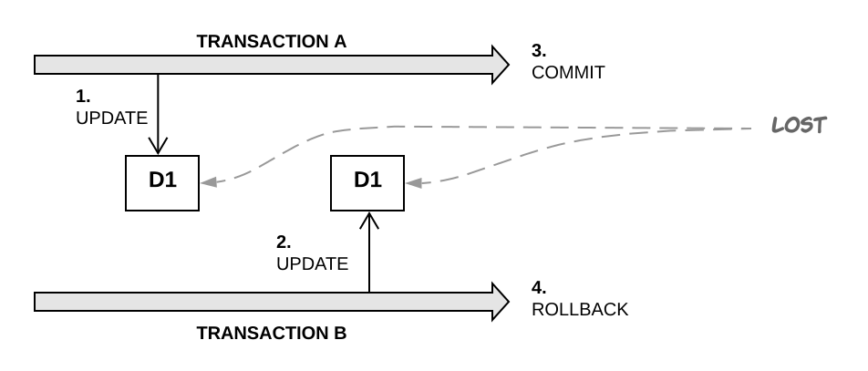
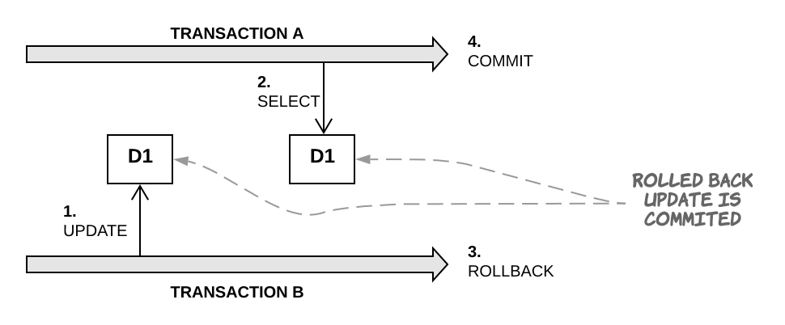
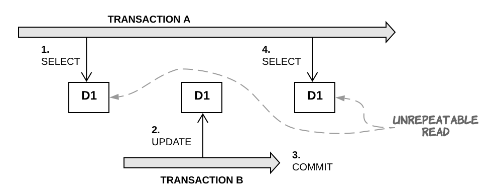
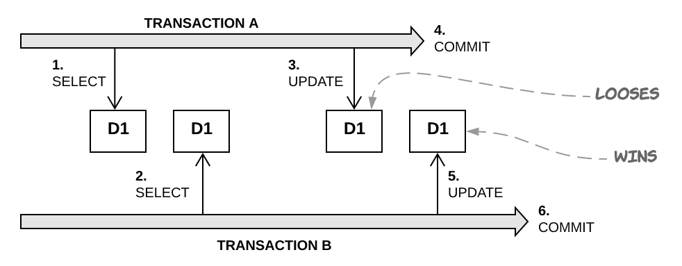
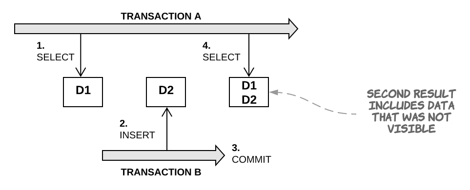

# Transaction Isolation Issues

**ANSI SQL standard defines the standard transaction isolation levels in terms of which of these phenomena are permissible.**

## Lost update

* Two transactions both update a data item (1, 2, 3).
* Second transaction aborts (4).
* Both changes are lost.

## Dirty read

* Transaction reads changes made by another transaction that hasn't yet been committed.
* This is dangerous because changes made by another transaction may later be rolled back and invalid data may be written by the first transaction.

## Unrepeatable read

* Transaction reads a data item twice and reads different state each time.

## Last commit wins

* Two concurrent transactions both read a data item.
* First transaction writes to it and commits.
* Second transaction writes and commits too.
* The changes made by the first writer are lost.

## Phantom read

* Transaction executes a query twice and the second result includes data that wasn't visible in the first result or less data because something was deleted.
