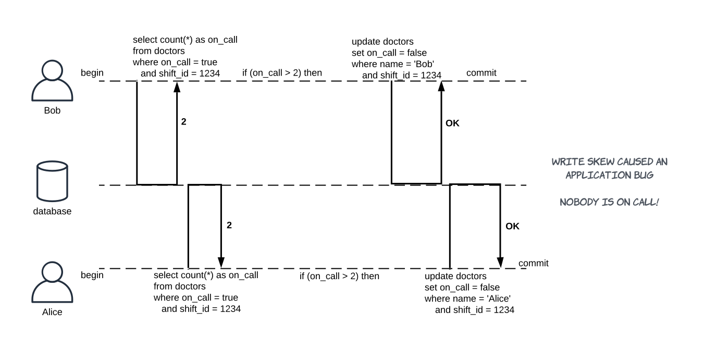

## Transaction Isolation Issues

TODO for each issue:
1. Description
2. Diagram
3. Test code in the persistence repo with a link here

---

### Questions for this article

1. What are three issues listed by the SQL-92 standard?
2. What are additional four issues?
3. Describe each issue, write a diagram that presents it.

---

### General notes

**This is all about moving from serializable transaction schedule to achieve better performance.**

The SQL-92 standard specifies three phenomena:
1. Dirty-read
2. Non-repeatable read
3. Phantom read

There are other phenomena when transactions are interleaving. These are particularly important in the MVCC systems:
4. Dirty write
5. Read skew
6. Write skew
7. Lost update

[More information about the read and write skew by Vlad Mihalcea here.](https://vladmihalcea.com/a-beginners-guide-to-read-and-write-skew-phenomena/)

---

### 1. Dirty read

**Transaction reads changes made by another transaction that hasn't yet been committed.**
**Dirty read violates atomicity.**

Dirty read case with rollback:

This is dangerous when changes made by `TRANSACTION B` are later rolled back and:
  * The code of the `TRANSACTION A` makes some decisions based on facts, that were rolled back.
  * The `TRANSACTION A` actually commits the rolled back data. 

This can also be a feature, not a bug in some cases, for example:
  * `TRANSACTION A` is a batch processing, a long-running one.
  * `TRANSACTION B` is used by a progress bar, it can see the status of the changes.

---

### 2. Non-repeatable read

**Transaction reads a data item twice and reads different state each time.**

* The `TRANSACTION A` could have done some work in between the updates.

---

### 3. Phantom read

**Transaction executes a query twice and the second result includes data that wasn't visible in the first result or less data because something was deleted.**

* You can avoid this by using **predicate locks**.

---

### 4. Read skew

**One transaction is able to see the database in an inconsistent state.**

* In reality, the unrepeatable read and read skew are closely related.

---

### 5. Dirty write

*At the end, both Bob and Alice commit and owner is 'Alice', whereas recipient of the Invoice is 'Bob'.*

**One transaction overwrites uncommitted changes from another transaction.**
* This happens when no exclusive locks are taken.
* So when one transaction does a rollback, nobody really knows what the previous state is.
* This breaks atomicity, it will not happen on any database.

### 6. Lost update

**One transaction overwrites already committed changes of another transaction.**

Lost update with rollback:

* Two transactions both update a data item (1, 2, 3).
* Second transaction aborts (4).
* Both changes are lost.

Lost update is usually linked with the application doing *read-modify-write cycle*.

Lost updated happen in different scenarios:
1. Modifying a counter, account balance (read, calculate the new value and then write back the updated value).
2. Making a local change to a complex value (eg. changing a document that requires parsing).
3. Two users modifying the same article with one user overwriting changes of the other.

---

### 7. Write skew

**Different transactions read the same objects and update some of them leading to a race condition and casuing an anomaly.**

* Write skew can be treated as a generalization of the lost update problem.
* When different transactions update the same object, you get a dirty write or lost update anomaly depending on the timing.
* When different transactions read the same objects and then update some of them (different transactions update different objects), you can get write skew.
* **Snapshot isolation does not prevent this.** Only proper locking, database constraints or serializable isolation would prevent this.

Other examples:
* Booking system, where you first select bookings for a date range and then, when none found, insert a new booking for the date range.
Race condition leads to an over-booking.
* Accounting system, where you first check the balance and only then subtract an amount.
Race condition leads to a negative balance.

In general:
1. A `SELECT` query checks whether a requirement is satisfied (no bookings, at least two doctors on call etc).
2. Depending on the result, the application code decides to continue or abort.
3. If application goes ahead, it does a modification (`UPDATE`, `DELETE` or `INSERT`).
4. The modification from point 3 changes the precondition of the decision in step 2.

A write in one transaction changes the result of a search query in another transaction - it is called a **phantom**.

---

### 8. Last commit wins

* Two concurrent transactions both read a data item.
* First transaction writes to it and commits.
* Second transaction writes and commits too.
* The changes made by the first writer are lost.

---
