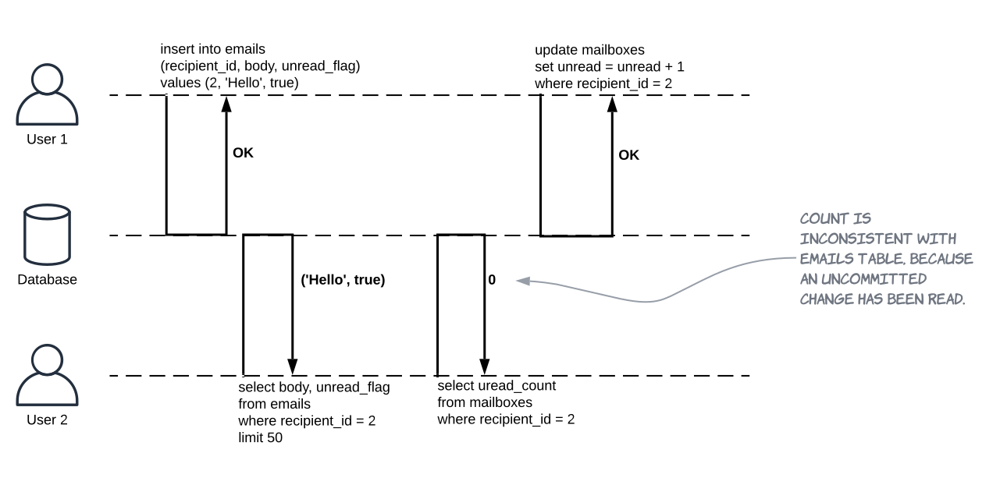
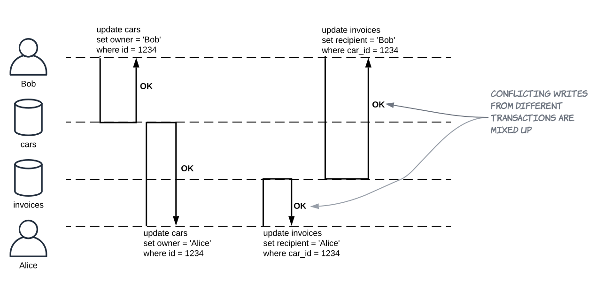
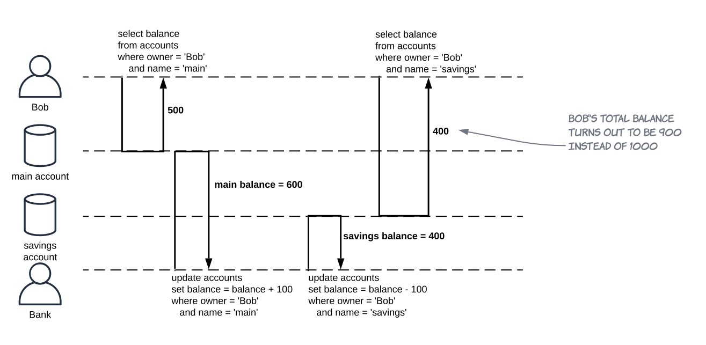

## Transaction Isolation Issues

TODO for each issue:
1. Description
2. Diagram
3. Test code in the persistence repo with a link here

---

### Questions for this article

1. What are three issues listed by the SQL-92 standard?
2. What are additional four issues?
3. Describe each issue, write a diagram that presents it.

---

### General notes

**This is all about moving from serializable transaction schedule to achieve better performance.**

The SQL-92 standard specifies three phenomena:
1. Dirty-read
2. Non-repeatable read
3. Phantom read

There are other phenomena when transactions are interleaving. These are particularly important in the MVCC systems:
4. Dirty write
5. Read skew
6. Write skew
7. Lost update

[More information about the read and write skew by Vlad Mihalcea here.](https://vladmihalcea.com/a-beginners-guide-to-read-and-write-skew-phenomena/)

---

### 1. Dirty read

**Transaction reads changes made by another transaction that hasn't yet been committed.**
**Dirty read violates atomicity.**

Dirty read case with rollback:

This is dangerous when changes made by `TRANSACTION B` are later rolled back and:
  * The code of the `TRANSACTION A` makes some decisions based on facts, that were rolled back.
  * The `TRANSACTION A` actually commits the rolled back data. 

This can also be a feature, not a bug in some cases, for example:
  * `TRANSACTION A` is a batch processing, a long-running one.
  * `TRANSACTION B` is used by a progress bar, it can see the status of the changes.

---

### 2. Non-repeatable read

**Transaction reads a data item twice and reads different state each time.**

* The `TRANSACTION A` could have done some work in between the updates.

---

### 3. Phantom read

**Transaction executes a query twice and the second result includes data that wasn't visible in the first result or less data because something was deleted.**

* You can avoid this by using **predicate locks**.

---

### 4. Dirty write

**One transaction overwrites uncommitted changes from another transaction.**
* This happens when no exclusive locks are taken.
* So when one transaction does a rollback, nobody really knows what the previous state is.
* This breaks atomicity, it will not happen on any database.

---

### 5. Read skew

**One transaction is able to see the database in an inconsistent state.**

* In reality, this is an example of unrepeatable read.

---

### 6. Write skew

TODO

---

### 7. Lost update

**One transaction overwrites already committed changes of another transaction.**

Lost update with rollback:

* Two transactions both update a data item (1, 2, 3).
* Second transaction aborts (4).
* Both changes are lost.

Lost update is usually linked with the application doing *read-modify-write cycle*.

Lost updated happen in different scenarios:
1. Modifying a counter, account balance (read, calculate the new value and then write back the updated value).
2. Making a local change to a complex value (eg. changing a document that requires parsing).
3. Two users modifying the same article with one user overwriting changes of the other.

---

### X. Last commit wins

* Two concurrent transactions both read a data item.
* First transaction writes to it and commits.
* Second transaction writes and commits too.
* The changes made by the first writer are lost.

---
