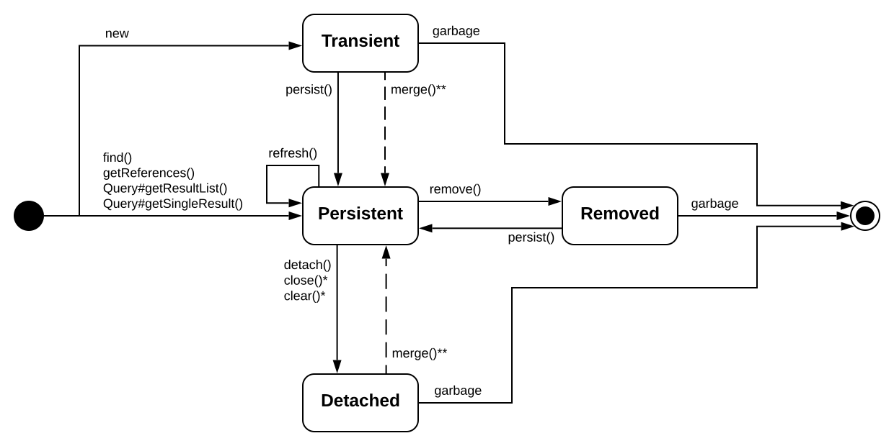

# Persistence Life Cycle

## Basic terms

* **Persistence life cycle** - states an entity goes through during its life.
* **Unit of work** - set of (possibly) state-changing operations considered one (usually atomic) group.
* **Persistence service** - a service that provides persistence context.
* **Persistence context** - overally it can be treated as a service that remembers all the modifications and state changes made to the data in a particular unit of work.

## Entity Life Cycle

**Transient state**:
* instance create with `new` and garbage-collected when it is no longer needed;
* no rollback mechanisms;
* **transition from transient to persistent means becoming managed**;
* from transient to persistent: calling `EntityManager#persist` or creating a refernce of an already-persistent instance with enabled cascading state for thap mapped association.

**Persistent state**:
* instance has a representation in the database;
* instance is stored in the database or will be stored when unit of work completes;
* instance with database identity;
* instance's database identifier is set to primary key value of the database representation;
* **instance always associated with a persistence context**.

Transitions to the persistent state:
* creating instance and calling `EntityManager#persist`;
* creating a reference to the object from another persistent instance that is already managed;
* retrieving from the database by executing a query, identifier lookup;
* navigating the object graph starting from another persistent instance.

**Removed state**:
* the provider will delete the entity instance from the database at the end of a unit of work;
* result of calling `EntityManager#remove()` or deleting reference from a mapped collection with `orphan removal` turned on.

**Detached state**:
* state entered when after getting the persistent instance, the unit of work is ended, the persistence context is closed and the application still has a *handle* - reference to the loaded instance;
* the instance can be discarded and garbage-collected;
* the instance can be worked on and then made persistent by calling `merge()`.

## Persistence context

* **In JPA, the persistence context is *application-managed* - the application defines it's scope.**

Important facts:
* **`EntityManager` has a persistence context.**
* **Persistence context is created by calling `EntityManagerFactory#createEntityManager()`.**
* **Persistence context is closed by calling `EntityManager#close()`.**
* **There is one `EntityManagerFactory` per persistence unit.**
* **The scope of the persistence context demarcates the unit of work.**

1. Automatic dirty checking:
  * Detecting which persistent entity instances have been modified by the application.
  * When unit of work completes, usually the state held in memory is propagated to database.

2. Persistence context as a `first-level cache`:
  * All the entitiy instances handled in a particular unit of work are remembered.
  * If lookup by identifier is requested, Hibernate will first check if the entity instance is present in the persistence context.

3. Persistence context cache ensures:
  * The persistence context is not vulnerable to stack overflows caused by circular references in an object graph.
  * There can never be conflicting representations of the same database row at the end of a unit of work.
  * Changes made in a particular persistence context are immediately visible to all other code executed inside that unit of work and its persistence context.
  * Only one instance represents a particular database row within one persistence context (other idea is process-scoped identity).

