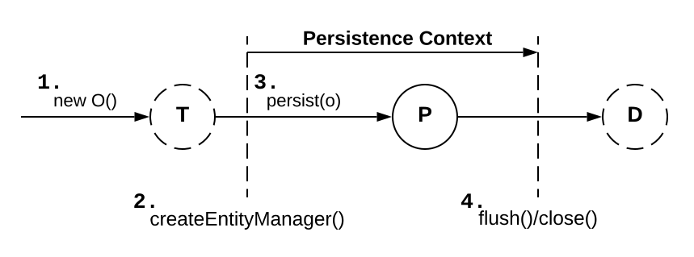

# Operations on data

**My unit tests for the described features:**
* [Enitity state transitions.]()
* [Entity references.]()
* [Read only operations.]()

## Making data persistent



```java
Item item = new Item();
item.setName = ("Some Item"); // Item#name is not null

entityManager.persist(item);             // Item#id will be assigned
Long itemId = item.getId();
```

Facts:
* Calling `EntityManager#persist()` transfers instance of `Item` from transient to persistent state.
* If identifier is *pre-insert*, calling `EntityManager#persist()` will only assign identifier to instance.
* If identifier is not *pre-insert*, calling `EntityManager#persist()` will make `INSERT` statement executed immediately.  
* After getting into the persistent state, the instance is managed and associated with the current persistence context.
* Having in mind the `INSERT` statement which is executed, it is better to fully initialize `Item` instance before managing it with a persistence context.

If one of the `UPDATE` or `INSERT` statements fail:
* Hibernate will rollback changes made to the persistent instances in the transaction at the database level.
* Hibernate will not roll back in-memory changes to persistent instances.

## Retrieving and modifying data


```java
Item item = entityManager.find(Item.class, itemId);

if (item != null)
  item.setName("New Name");
```

Facts:
* The retrieved instance is in persistent state and can be modified inside the unit of work.
* Hibernate will perform dirty checking to know if an `UPDATE` is neccessary.
* If any changes were made, Hibernate will try to propagate state changes to the database as late as possible, toward the end of the transaction.

What is updated:
* All the columns of the mapped `ITEM` table are in the SQL `UPDATE` statement.
* Hibernate updates unchanged columns to their old values.
* Rationale: these basic SQL statements can be generated at startup.
* Avoiding: you can enable dynamic SQL generation.

**Object-identity guarantee - repeatable reads of the same row provide the same object instance.**

```java
Item firstFoundItem = entityManager.find(Item.class, itemId);
Item secondFoundItem = entityManager.find(Item.class, itemId); // cached item should be retrieved

assertSame(firstFoundItem, secondFoundItem);
assertEquals(firstFoundItem, secondFoundItem); 
```

## Getting a reference to data

```java
Item item = entityManager.getReference(Item.class, itemId);

PersistenceUnitUtil persistenceUtil = JPA.getEntityManagerFactory().getPersistenceUnitUtil();
assertFalse(persistenceUtil.isLoaded(item));

// This would initialize proxy
assertEquals(item.getName(), "Some Item");
// This would load proxy data
Hibernate.initialize(item);

transaction.commit();
entityManager.close();

// The data is there
assertEquals(item.getName(), "Some Item");
```

Creating reference:
* If persistence context already contains an `Item` with given ID - the instance is returned without hitting the database.
* If not - Hibernate returns a hollow placeholder: a proxy.
* **This way, `EntityManager#getReference()` does not access the database!**

Loading data:
* Invoking a method on the proxy makes Hibernate execute `SELECT` to fully initialize the placeholder.
* If the database record no longer exists - `EntityNotFoundException` is thrown.
* Data can be loaded also with static `Hibernate#initialize()` method.

Detached state:
* After the persistence context is closed, the `item` is in detached state.
* If the proxy is not initialized when context is open, any access to it results in `LazyIntializationException`.

[Proxy pattern in Java](https://refactoring.guru/design-patterns/proxy/java/example)

## Making data transient


```java
Item item = entityManager.find(Item.class, itemId);

entityManager.remove(item);

assertFalse(entityManager.contains(item));

// entityManager.persist(item); // this would cancel deletion

assertNull(item.getId());       // this succeeds when hibernate.use_identifier_rollback was enabled

transaction.commit();
entityManager.close();
```

Facts:
* Hibernate will set the id to `null` after `EntityManager#remove()` if the id is managed by Hibernate and `hibernate.use_identifier_rollback` is enabled.
* After calling `EntityManager#remove()` the entity moves to removed state.
* The entity can be made persistent again with `EntityManager#persist()`.
* When transaction commits, Hibernate synchronizes state transitions with the database and executed SQL `DELETE`.
* If `EntityManager#remove()` is called on a proxy, it will be fully initialized before any life cycle transitions.

## Refreshing data

```java
Item item = entityManager.find(Item.class, itemId);
item.setName("Some Name");

// Someone updates this row in the database

String oldName = item.getName();
entityManager.refresh(item);
assertNotEquals(item.getName(), oldName);
```

Facts:
* If the row has been deleted in the meanwhile, `EntityNotFoundException` is thrown.
* All the changes made to the persistent instance in the application memory are overwritten with data loaded from database.

## Replicating data

```java
transaction.begin();

EntityManager entityManagerA = getDatabaseA().createEntityManager();
Item item = entityManagerA.find(Item.class, itemId);

EntityManager entityManagerB = getDatabaseB().createEntityManager();
entityManagerB.unwrap(Session.class)
  .replicate(item, org.hibernate.ReplicationMode.LATEST_VERSION);

transaction.commit();
entityManagerA.close();
entityManagerB.close();
```

`ReplicationMode` controls the details of the replication procedure. For example `LATEST_VERSION` overwrites the row in the database if its version is older than the version of the given entity instance, or ignores the instance otherwise.

## Caching data

Ignoring persistence context size may result in `OutOfMemoryException`:
* Persistence context is a cache of persistent instances, every entity instance in persistent state is associated with it.
* Loading thousands of entity instances in an unit of work may cause memory exhaustion.
* Loading too many items with large object graphs, when you need just a few.

Methods of avoiding this in JPA:
* `EntityManager#detach(item)` evicts a persistent instance manually from the context.
* `EntityManager#clear()` detaches all persistent entity instances; this leaves an empty persistence context.
* Using query hints with `EntityManager#createQuery()` and `Query#setHint()` to read-only.

```java
Query query = entityManager.createQuery(queryString)
  .setHint(
    org.hibernate.annotations.QueryHints.READ_ONLY,
    true
  );
```

Hibernate-specific methods to disable dirty-checking:
1. `Session#setDefaultReadOnly()` enables setting the entire persistence context to read-only mode.
2. `Session#setReadOnly()` enables setting on entity to read-only mode.
3. `Query#setReadOnly()` enables returning read-only results.

```java
entityManger.unwrap(Session.class).setDefaultReadOnly(true);

Item item = entityManager.find(Item.class, itemId);
item.setName("New Name");

entityManager.flush(); // no update
```

```java
Item item = entityManager.find(Item.class, itemId);

entityManger.unwrap(Session.class).setReadOnly(item, true);

item.setName("New Name");

entityManager.flush(); // no update
```

```java
org.hibernate.Query query = entityManager.unwrap(Session.class)
  .createQuery("select i from Item i");

query.setReadOnly(true).list();

List<Item> result = query.list();

for (Item item : result)
  item.setName("New Name");

em.flush(); // no update
```
 
**Beware: the read-only entity instances can be deleted, modifications to collections may be tricky. Refer to Hibernate manual for details.**

## Flushing the persistence context

Automatic flushing of the persistence context happens when:
* The joined JTA system transaction is committed.
* Before a query is executed with `javax.persistence.Query` or similar Hibernate API.
* When application calls `EntityManager#flush()` explicitly.

Controling flushing mode:
* `FlushModeType.AUTO` - this is the automatical mode.
* `FlushModeType.COMMIT` - flushing before queries is disabled, it will happen only when transaction is committed or an explicit call to `EntityManager#flush()` is made.


