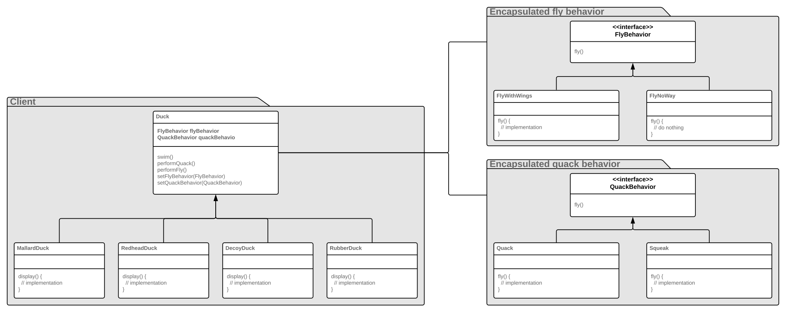

# Design patterns from Heads First Book

## Why patterns are important

1. They help to create flexible designs that are mainainable and can cope with change.
2. They provide vocabulary to communicate with other developers.
3. They enable to stay at the "design level" a bit longer, analize the abstraction before getting down to implementation.
4. Widen the variety of solutions to problems in mind.
5. They are more than only OO design principles - they are (sometimes non-obvious) ways of constructing object-oriented systems, that otherwise would be achieved by hard, iterative work.
6. 

## Strategy

**Definition**: the strategy patterns defines a family of algorithms, encapsulates each one, and makes them interchangeable. Strategy lets the algorithm vary independently from clients that use it.

**Advantages**:
* new behavior can be added without modifying any of the existing ones and without touching any of the client classes;
* the client class delegates its behavior to the behavior class by having an object with right interface;
* no implementation details leak to the client class, it owns interface;
* the behavior (also called *algorithm*) can be changed dynamically;

Rules used mostly: *favor composition over inheritance* and *encapsulate what varies*.

## Observer

### First approach

**Definition**: the observer pattern defines a one-to-many dependency between objects so that when one object changes state, all of its dependents are notified and updated automatically.

**Facts**:
* the one-to-many means that there is one object that owns and controls the state, and there can be multiple observers;
* the dependency in the definition means that the subject is the sole owner of the data, the observers are dependent on the subject to update them when the data changes.

**Advantages - mainly loose coupling**:
* subject knows only that an observer implements a certain interface;
* new observers can be added at any time;
* we never need to modify the subject to add new types of observers;
* we can reuse subjects or observers independently of each other;
* changes to either the subject or an observer will not affect the other.

### Java built-in Observer Pattern

**Facts**:
* `Observable` is a class and every subject class must extend it, automatically inheriting the add, delete and notify Observer methods.;
* to send notifications you must call `setChanged()` method and then call one of notification methods - `notifyObservers()` or `notifyObservers(Object arg)`;
* to receive notifications you must implement `update(Observable o, Object arg)` method;
* without calling `setChanged()` the observers will not be notified; this is giving flexibility with the notification frequency should be sent;
* **never depend on order of evaluation of the Observer notifications**.

**Two notification models**:
* pull model - notifying with `notifyObservers()` and letting them pull the data  (*considered more correct*);
* push model - notifying with `notifyObservers(Object arg)`.

**Disadvantages**:
* `Observable` is a class, this violates *program to an interface, not implementation rule*.
* `Observable` has to be subclassed and only one class can be extended at a time - this limits reuse potential;
* `Observable` method `setChanged()` is protected - it cannot be called unless it is subclassed; this means you can't create an instance of the Observable class and compose it with your own objects;

## Decorator

**Definition**: attaches additional responsibilities to an object dynamically. Decorators provide a flexible alternative to sublassing for extending functionality.

**Advantages**:
* enables to add its own behavior either before and/or after delegating to the decorated object to do the rest of the job;
* objects can be decorated at any time, dynamically, with as many decorators as we like;
* the decorators stand in place of the component and add new behavior and/or state.

**Facts**:
* using inheritance here may seem to break rules, but it is used for *type matching*; the decorators have to stand in place of the component;
* the inheritance is not used to get *behavior* - this comes through composition of decorators with the base components and other decorators;
* the component class can be either an interface or abstract class.

**Disadvantages**:
* decorator patterns often results in a lot of small classes to design;
* used uncarefully can increase complexity of the code;
* usually makes constructing objects more complicated - the compontent and decorators have to be instantiated.

### Decorators in Java I/O

