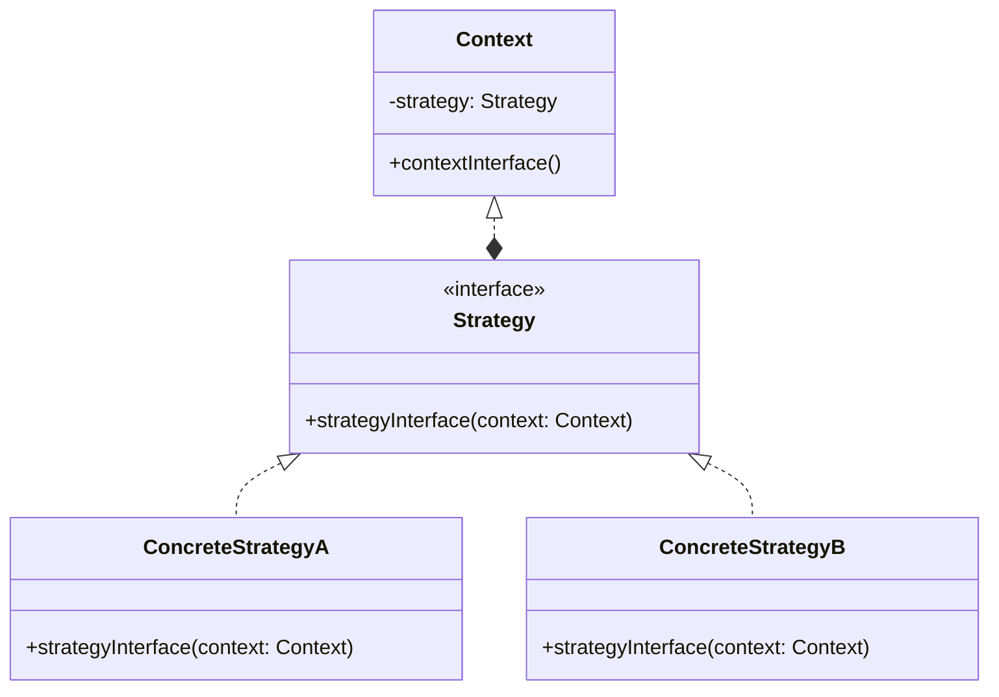
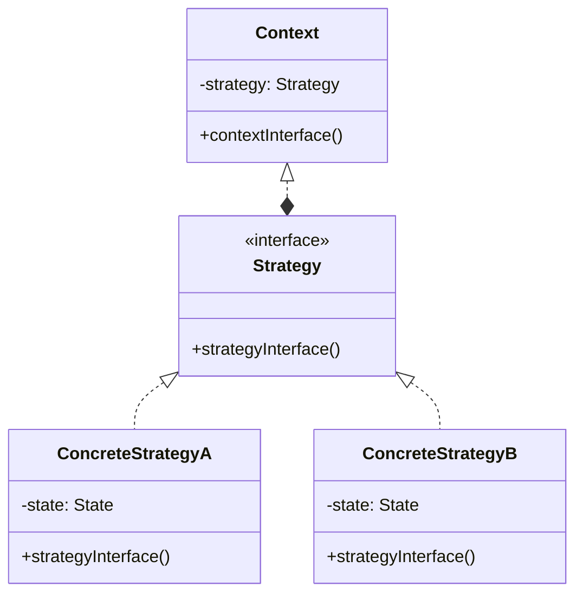

## Trying out the Mermaid diagrams

Extrinsic state example:

```mermaid
classDiagram
    class Context {
        -strategy: Strategy
        +contextInterface()
    }
    class Strategy {
        <<interface>>
        +strategyInterface(context: Context)
    }
    class ConcreteStrategyA {
        +strategyInterface(context: Context)
    }
    class ConcreteStrategyB {
        +strategyInterface(context: Context)
    }
    Context <|..* Strategy
    Strategy <|.. ConcreteStrategyA
    Strategy <|.. ConcreteStrategyB

```

Intrinsic state example:

```mermaid
classDiagram
    class Context {
        -strategy: Strategy
        +contextInterface()
    }
    class Strategy {
        <<interface>>
        +strategyInterface()
    }
    class ConcreteStrategyA {
        -state: State
        +strategyInterface()
    }
    class ConcreteStrategyB {
        -state: State
        +strategyInterface()
    }
    Context <|..* Strategy
    Strategy <|.. ConcreteStrategyA
    Strategy <|.. ConcreteStrategyB
```