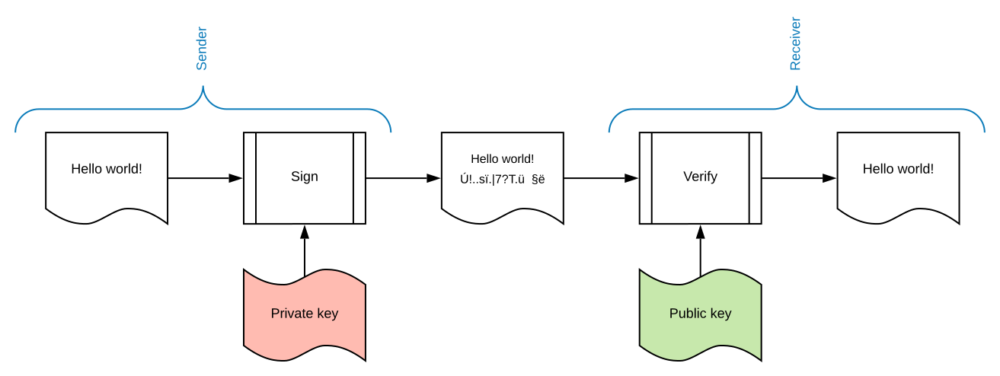
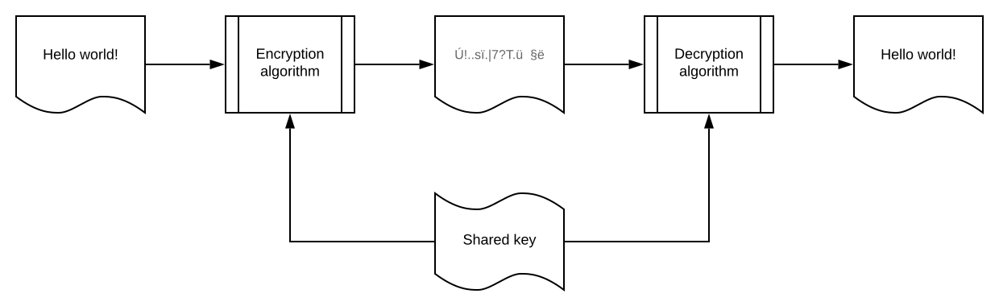
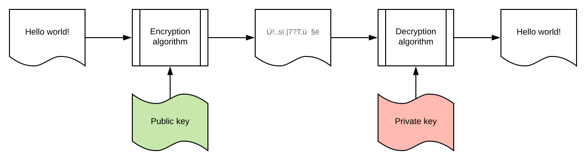

# Security basics

## Authentication vs. Authorization

* **Authentication** - verification of the credentials of the connection attempt. The remote access client sends the credentials to the remote access server in an either plaintext or encrypted form using **authentication protocol**.
* **Authorization** - verification that the connection attempt is allowed.

**Authentication is stating that you are who you are and authorization is asking if you have access to a certain resource.**

## Signing vs. encryption

### Signing
**You use your private key to generate message's signature and they use your public key to check if it is really yours and if the message has not been changed**.

Usages:
* checking if the sender is who is claims to be;
* checking if the message has not been modified by third-party;
* generating information that only you can generate (product-keys).

### Encryption
**You use their public key to write message and they use their private key to read it.**

Usages:
* generating a message that can be read only by private key owner.

## Cryptography types:

### Symmetric encryption

**Process of encoding a message using the same key for both encoding and decoding.**

### Asymmetric encryption

**Process of encoding a message using one key - public key to encrypt and another key - private key to decrypt.**

## Token types

* **By reference** - like a credit card. A third service is required to know the person (here: account balance) from the token.
* **By value** - like a banknote. The only thing to be checked is if the token has not been forged (like a banknote).

## Cookies

## LDAP

