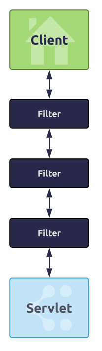
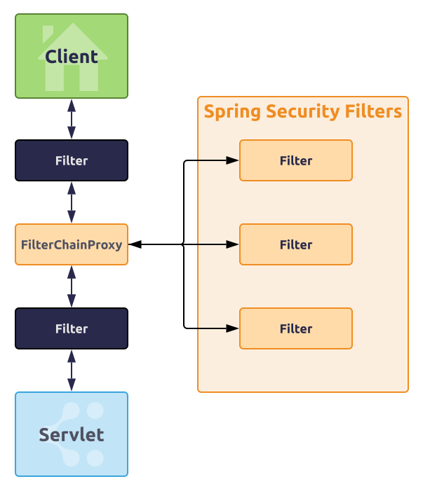
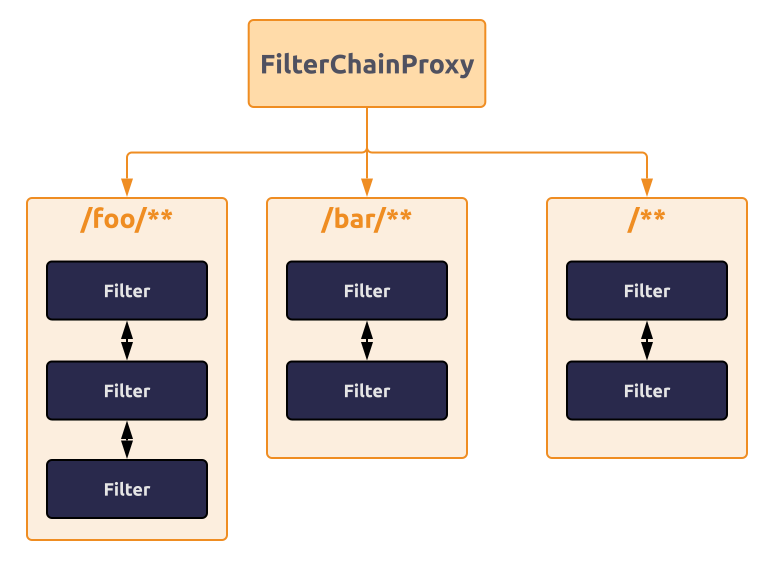
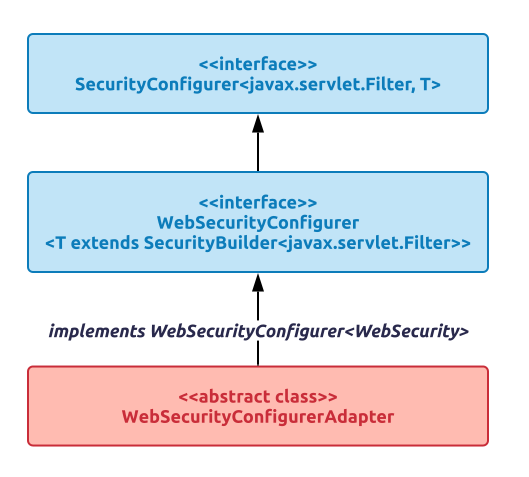

# Spring Security Filters

[Root article](./spring_security.md)

## Servlet Filters - overall

Spring Security in the Web context is based on `Servlet Filters`.
`Filters` form layers of HTTP request handlers.

The client sends the application the request and:
* the containers decides which filters and which servlet to apply based on the request URI;
* the filters are ordered and form a chain;
* each filter can veto the rest of the chain if it wants to handle the request itself;
* each filter can modify the HTTP request and/or the response;

The order of filters is very important, there two ways Spring manages it:
* `@Beans` of type `Filter` can have an `@Order` or implement `Ordered`;
* `@Beans` of type `Filter` can be a part of `FilterRegistrationBean` that itself has an order as part of its API.



## Servlet Filters - Spring Security

Spring Security uses `Servlet Filters`:
* it is installed as a single `Filter` in the chain;
* concrete type is `FilterChainProxy`;
* in a Spring Boot app the security filter is a `@Bean` in the `ApplicationContext` and is installed by default so that it is applied to every request.



The `@Bean` `FilterChainProxy`:
* contains all security logic arranged internally as a chain (or chains) of filters;
* all the filters have the same API (implement `Filter` interface);
* all the filters have the opportunity to veto the rest of the chain;
* the Spring Security FilterChainProxy dispatches requests to the first chain that matches;
* **in the dispatch process only one chain ever handles a request.**.



## Adding new Security Filters

Default fallback filters in Spring Boot app:
* has `/**` request matcher;
* has a predefined order of `SecurityProperties.BASIC_AUTH_ORDER`;
* can be switched off with `security.basic.enable=false`
* can be used as a fallback with other filters **with a lower order**.

To implement custom security filters:
* add a `@Bean` of type `WebSecurityConfigurer` which is an interface that allows customization of `WebSecurity`;
* add a `@Bean` of type `WebSecurityConfigurerAdapter` which is an abstract class that allows customization by overriding methods.



```
@Configuration
@Order(SecurityProperties.BASIC_AUTH_ORDER - 10)
public class ApplicationConfigurerAdapter extends WebSecurityConfigurerAdapter {
  @Override
  protected void configure(HttpSecurity http) throws Exception {
    http.antMatcher("/foo/**")
      .authorizeRequests()
        .antMatchers("/foo/bar").hasRole("BAR")
        .antMatchers("/foo/spam").hasRole("SPAM")
        .anyRequest().isAuthenticated();
  }
}
```


