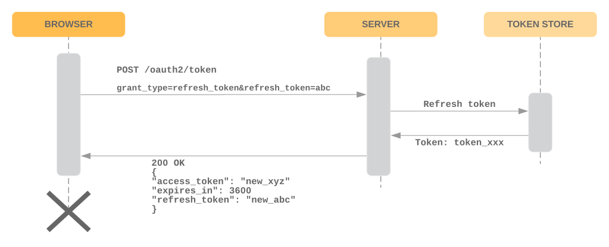

# Authentication methods

## Basic Auth

### Mechanism

Example message:
```
POST /painter/color/object HTTP/1.1
Host: localhost:8443
Authorization: Basic c25vb3BSOnBhc3M=
User-Agent: curl/7.43.0
Accept: */*
Content-Type: application/json
Content-Length: 45

{"color"{"b":255,"g":0,"name":"blue","r":0}}
```

**Creating authorization header**: "Basic " + `Base64(username+password)`.

### Drawbacks:
1. Single point of failure - if 3000 TPS comes in, 3000 TPS goes to LDAP.
2. There is usually no security of traffic inside the organisation.
* Target was hacked this way - by contractors. 
* Provided that 3 kTPS comes from outside and generates 12 kTPS in backend: if all of the transactions in the backend were to be secured it would add to 15 kTPS on LDAP! Impossible to manage.
* You could use IP whitelisting, but this is unelastic.
3. We are not securing the backend.
* One microservice serves the other without any information about who makes the request.
4. DDOS attacks - 3000 kTPS of normal usage and 6000 kTPS of attack transactions sums to 9000 kTPS on LDAP - dead.

## OAUTH 2

### Mechanism

Password grant process:


Refresh grant process (generates new access token and refresh token):


Example message:
```
POST /painter/color/object HTTP/1.1
Host: localhost:8443
Authorization: Bearer xyz
User-Agent: curl/7.43.0
Accept: */*
Content-Type: application/json
Content-Length: 45

{"color"{"b":255,"g":0,"name":"blue","r":0}}
```

**Creating authorization header**: "Bearer " + `access_token`.

### Drawbacks:
1. A lot new passwords (aka. tokens) - every device has one.
2. This is just login process with new vocabulary:
* *password grant* = logging in;
* *token* = slightly less crappy password and equally crappy HTTP Session ID.
3. Incomming 3 kTPS go to LDAP server and Token service - two points of failure.
4. There is **still** no way to authorise inside backend between services - the inside 12 kTPS would go to LDAP which would sum with the incomig 3 kTPS - dead instantly.
5. OAuth 2.0 can be called **High Frequency Password Exchange Algorithm**. The refresh_token is totally optional, which leads to a event simpler mechanism.

## JSON Web Tokens

### Mechanism:
1. Take JSON map of user data.
2. Base64 the contents.
3. Sign it with symmetric or asymmetric cryptography.
4. Give this to the user.

### Message:
Two JSON maps and signature:
1. First map - header - the signing method.
2. Second map - payload - sometimes called the cookie, user data.

In previous solutions the **client holds the pointer and server stores the state**.

Now, the **client stores the state** and **the pointer is stored on the server side** (for revocation).

### Benefits:
1. Given there are 3 kTPS comes from outside, there are 3 kTPS signature verification requests, but there are 0.55 TPS refresh token checks!
2. If the cryptography is asymmetrical:
* The gateway generates the signature using the private key - nobody else has it.
* The message can be verified from everywhere using the public key. There is no additional cost of introducing security inside the enterprise (no adding of internal 12 kTPS to the central database).
3. Invunreability to DDOS: 
* If there are 6 kTPS additional invalid requests, there are no additional requests to check the token in central server. They are stopped in the front door.
* Evil traffic does not affect the good traffic as it is stopped right in front of the gate.

## HTTP Signatures (Amazon EC2 style API Security)

### Mechanism

**The actual HTTP message is signed.** Instead signing a map in gateway like in JWT, the client signs the headers:
1. Take the headers and concatenate them in a big long line.
2. Hash them.
3. Use symmetric key to sign that.
4. Base64 the contents.

```
POST /painter/color/object HTTP/1.1
Host: api.superbiz.io
Authorization: Signature keyId="my-key-name",
algorithm="hmac-sha256"
headers="content-length host date (request-target)",
signature="j050ZC4iWDW+Vx=..."
Date: Mon, 19 Sep 2016 16:51:35 PDT
Accept: */*
Content-Type: application/json
Content-Length: 46

{"color"{"b":255,"g":0,"name":"blue","r":0}}
```

You can choose the headers to sign, per recommendation you should choose at least the `Date` header. 
This is protection against replay attacks. If the data does not change, then the hash is going to be the same, so the signature will be the same.
Someone could listen to the exchange, spot this and replay some requests with their data claiming to be you. With the date inside the hashed data, this is not the case.

#### JWT vs HTTP signature:

* **JWT - signature around the user data.**
* **HTTP Signatures - signature around the HTTP message.**

### Benefits:
1. No secrets (tokens, passwords) are sent along the wire. (your Amazon key stays in your pocket)
2. Every next message the signage has another value.

### Drawbacks:
1. There is no way of security inside enterprise - between each next service, we need to sign the message separately. We don't have user's key in every microservice.

### Use case (Amazon EC2):
* Client side:
1. When you create an account, you get access token key id and access token.
2. Each time you use their client library, you provide the library with these two values.
3. They use the key value to sign the outgoing message and put the key message inside.
4. The message is sent.
* Server side:
1. The server makes the same signing string using the same rules.
2. The key value is looked up and used to sign the message.
3. If the base64 bytes are the same - you are allowed to enter.

### Mixing OAuth2 and Signatures

**The best mix of concerns.**

From the front: **take the user login via OAuth2**.
From the back: **implement the signatures in each point in the backend**.
* Why? Simply passing the token around the backend and allowing each request with access token of the user to have all the information might be too insecure. 
One minor service could request some critical data.
* How? Issue symmetric key that is required to be possessed by services who want to issue some information.
The key is issued per domain - only to between the services which should communicate.

