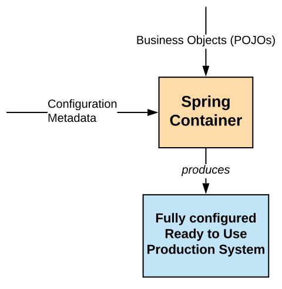

# Spring IoC Container

[Inversion of Control as a pattern](./ioc.md)

## IoC in Spring

Basic packages for IoC:
* `org.springframework.beans`;
* `org.springframework.context`.

Interfaces:
* `BeanFactory` - mechanism capable of managing any type of object;
* `ApplicationContext` - sub-interface of BeanFactory, ads more enterprise-specific functionality.

## IoC container overview

**Spring Container** is represented by `ApplicationContext` interface:
* responsible for instantiating, configuring and assembling the beans;
* frequently used implementations: `ClassPathXmlApplicationContext`, `FileSystemXmlApplicationContext`.

**Configuration Metadata** are instructions for `ApplicationContext` on:
* what objects to instantiate;
* how to configure them;
* how to assemble them.

[More on `ApplicationContext` in its JavaDoc](https://docs.spring.io/spring-framework/docs/current/javadoc-api/org/springframework/context/ApplicationContext.html)

## Providing Configuration Metadata

There are overally four ways to provide the configruation to Spring container:
* XML-based configuration with `<bean>` elements inside a top-level `<beans>` element;
* Annotation-based configuration ([docs](https://docs.spring.io/spring/docs/current/spring-framework-reference/core.html#beans-annotation-config));
* Java-based configuration using `@Configuration` classes, `@Bean`, `@Import` and `@DependsOn` annotations ([docs](https://docs.spring.io/spring/docs/current/spring-framework-reference/core.html#beans-java));
* Groovy Bean Definition DSL.

**Overally, Spring IoC container itself is totally decoupled from the format in which the configuration metadata is written.**

XML-based configuration:
* usually there is more than one file - for example one per layer: `daos.xml`, `service.xml`, etc.
* XML files can be composed of other files using `<import resource="path"/>`;
* while creating beans, their scope, lifecycle callbacks, dependencies etc. can be set.
