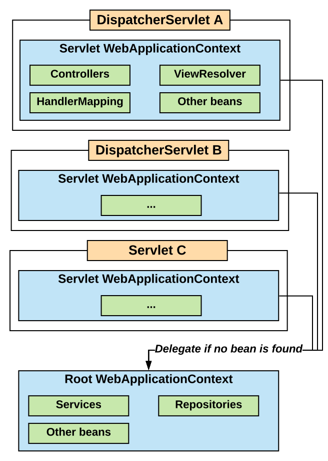

# Spring WebMVC - Servlet configuration

## File `web.xml`

The `web.xml` file:
* obligatory in J2EE web application;
* specified by J2EE;
* general behavior of the application is described here;
* things configured: servlets, filters, security policy, etc.

## Enabling web application context from Spring

The interface `org.springframework.web.context.WebApplicationContext`:
* extends `ApplicationContext`;
* provides configuration for a web application.

The class `org.springframework.web.context.ContextLoaderListener`:
* implements Java EE `ServletContextListener`;
* is usually registered in `web.xml`;
* ties the `WebApplicationContext` lifecycle with the servlet context lifecycle.

## Spring contexts configuration

**Spring enables multiple contexts to be configured in a parent-child hierarchy.**

**Application context** is configured by default in `applicationContext.xml` (to be set by `<contextConfigLocation>`):
* root application context;
* beans that are shared between all servlets in a web application.

**Servlet context** is configured by default in `<servlet-name>-servlet.xml`:
* context for the servlet;
* this context can reference beans from **Application context**, but not vice-versa.

It is possible to have multiple instances of `DispatcherServlet` with:
* one root `WebApplicationContext` shared across them;
* child `WebApplicationContexts` for each of the instances;
* the child context will delegate to its parent, if no bean is found.

